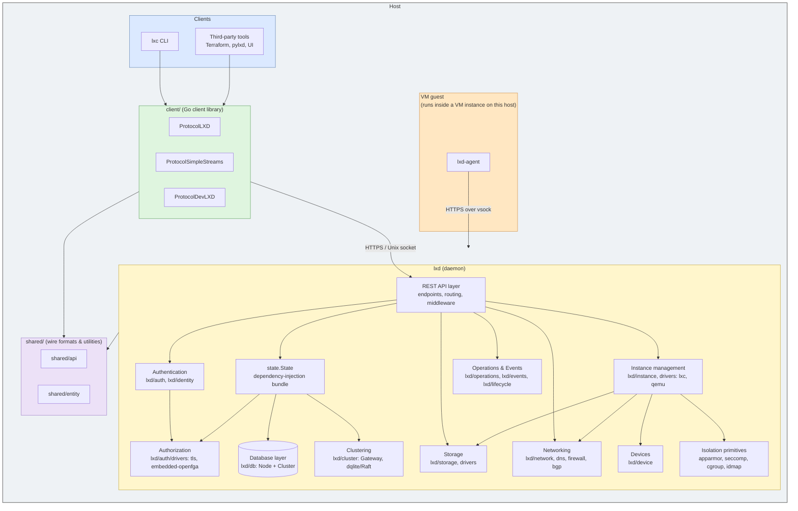
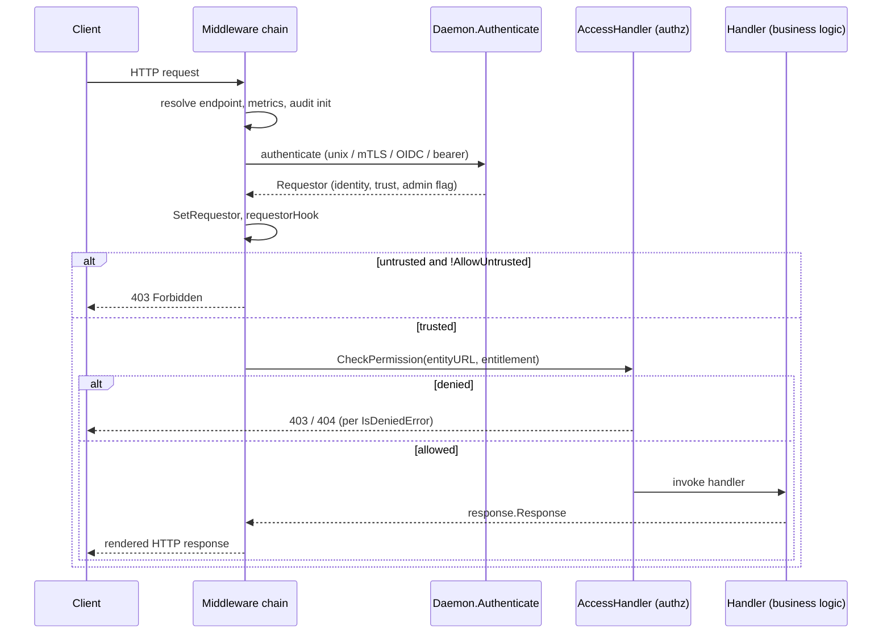
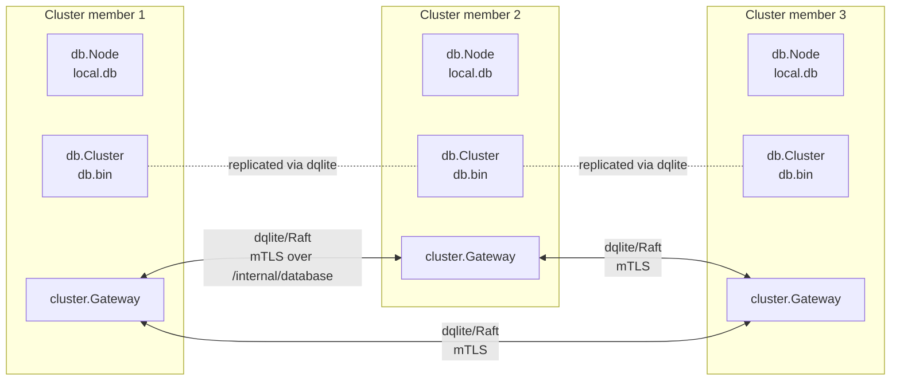
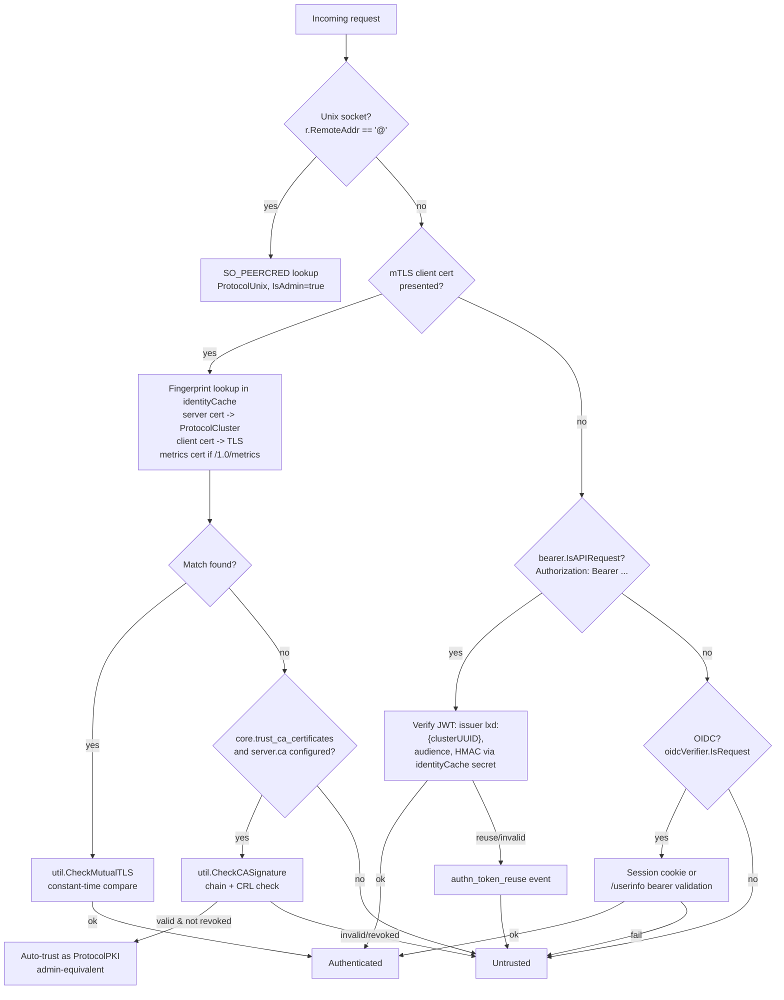
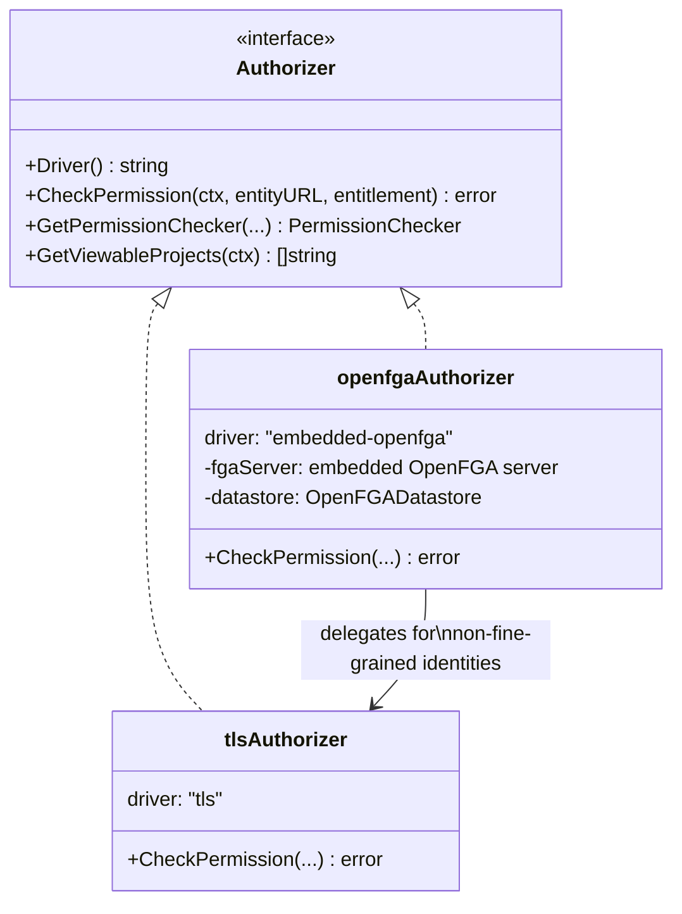
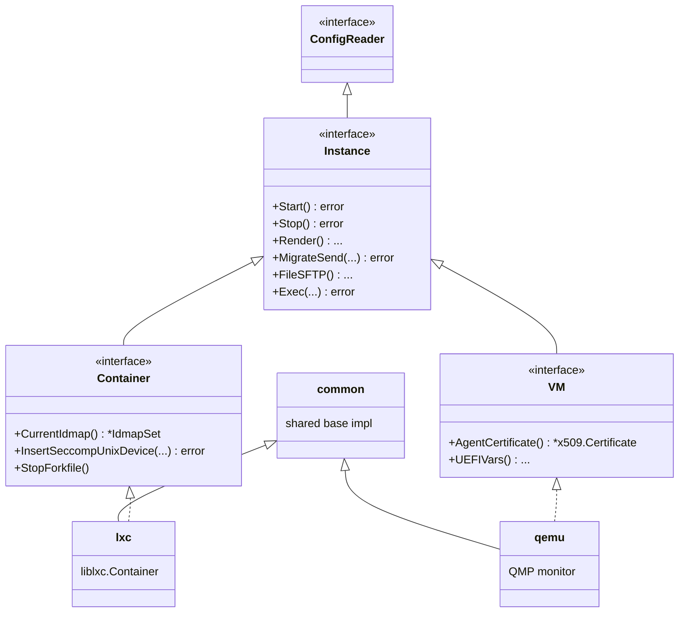
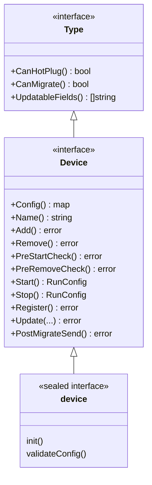
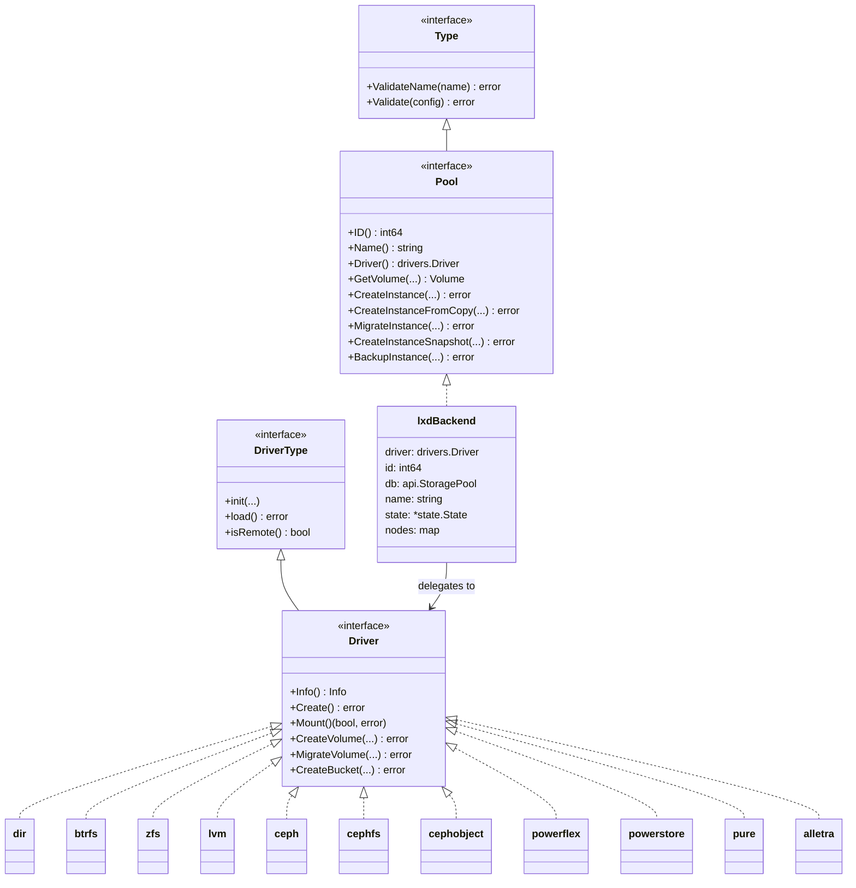
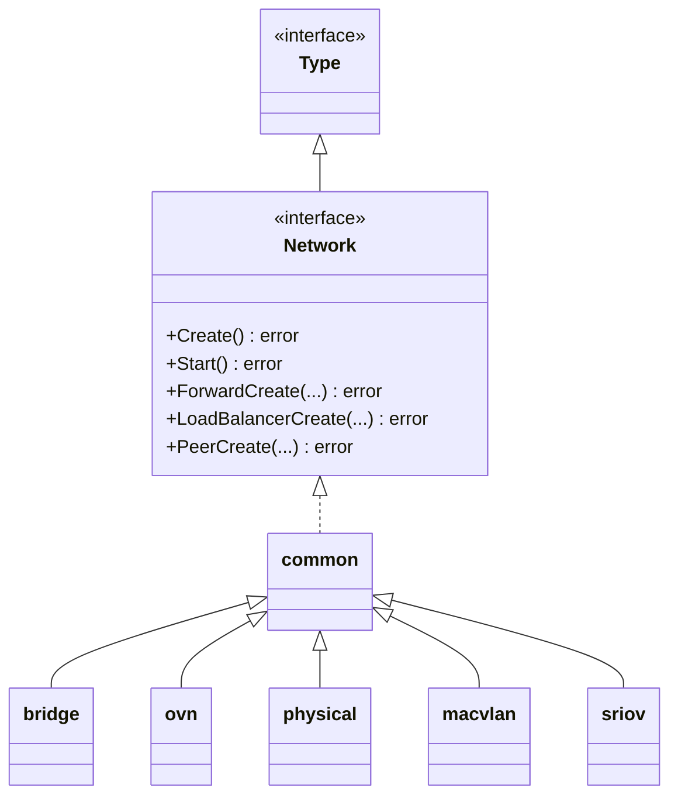
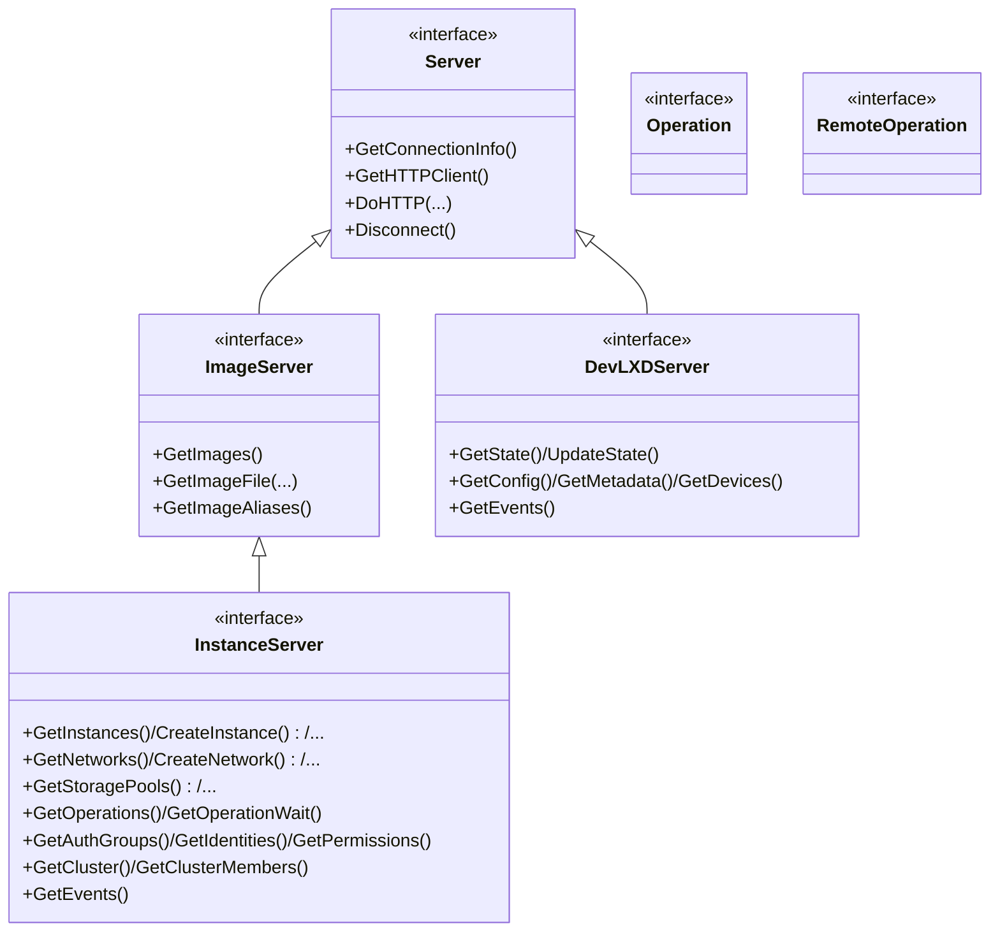

# LXD Architecture

This document describes the internal architecture of LXD for engineers who are new to the
codebase. It covers the major components, the interfaces and concrete types that make up
each component, and how the components interact. Where helpful, Mermaid diagrams illustrate
relationships and request flows.

For the security model specifically, this document gives a summary in
[Section 11](#11-security-model-summary) and points to
[THREAT_MODEL.md](THREAT_MODEL.md) for a full enumeration of threats and mitigations.

## Table of contents

1. [Introduction](#1-introduction)
2. [Component map](#2-component-map)
3. [Daemon core (`lxd/`)](#3-daemon-core-lxd)
4. [Database and clustering](#4-database-and-clustering)
5. [Authentication, identity and authorization](#5-authentication-identity-and-authorization)
6. [Instance management](#6-instance-management)
7. [Storage](#7-storage)
8. [Networking](#8-networking)
9. [Client library and shared code](#9-client-library-and-shared-code)
10. [CLI, VM agent and auxiliary binaries](#10-cli-vm-agent-and-auxiliary-binaries)
11. [Security model summary](#11-security-model-summary)
12. [Further reading](#12-further-reading)

---

## 1. Introduction

LXD is a daemon (`lxd`) that manages system containers (via `liblxc`) and virtual machines
(via QEMU/KVM), exposed through a REST API over Unix socket and/or HTTPS. It supports
clustering (via dqlite/Raft), fine-grained authorization (via an embedded OpenFGA server),
and pluggable storage and network backends.

The repository module is `github.com/canonical/lxd` and is laid out as:

```
lxd/            Main daemon (the bulk of the business logic)
lxc/            Command-line client ("lxc")
lxd-agent/      Guest agent that runs inside virtual machines
client/         Go client library (used by lxc, lxd-agent host side, and third parties)
shared/         Code shared across all of the above (wire-format types, utilities)
lxd-user/       Per-user unprivileged daemon/proxy
lxd-benchmark/  Performance benchmarking tool
lxd-convert/    Physical/VM-to-LXD conversion tool
fuidshift/      UID/GID remapping tool for filesystems
test/           Integration test suites (bash) and lint scripts
doc/            Sphinx documentation
```

A single Go binary (`lxd`) contains the daemon plus a large family of `forkXXX` re-exec
subcommands used to perform narrowly-scoped privileged operations (see
[3.1](#31-entry-points-and-the-re-exec-pattern)).

---

## 2. Component map

The diagram below shows the major components and their primary dependencies. Arrows show
"depends on" / "calls into" relationships, not data flow. Everything shown runs on the host;
the `VM guest` box is nested inside it because a VM (and the `lxd-agent` running in its guest
OS) is itself a process on the host. The boxes are stacked roughly by call-stack depth, with
entry points (`Clients`, `VM guest`) at the top and the lowest-level shared code (`shared/`) at
the bottom.



Containers have no equivalent guest-side binary: privileged per-container operations (e.g.
file access via `forkfile`, exec via `forkexec`) are performed by short-lived child processes
that re-run the host's `lxd` binary and enter the container's namespaces (see
[3.1](#31-entry-points-and-the-re-exec-pattern)), not by a separate agent. VMs are the only
instance type with a distinct guest-side LXD component (`lxd-agent`).

---

## 3. Daemon core (`lxd/`)

### 3.1 Entry points and the re-exec pattern

`lxd/main.go` defines a Cobra root command (`cmdGlobal`, with global `--debug`/`--verbose`
flags) and a large family of subcommands. The most important is `cmdDaemon` (`lxd activateifneeded`,
`lxd waitready`, `lxd --group lxd`, etc.), which starts the long-running daemon process.

Alongside the daemon command, the binary contains many `main_fork*.go` files implementing
`forkXXX` subcommands: `forkfile`, `forkmount`, `forkproxy`, `forknet`, `forkexec`,
`forkstart`, `forkdns`, `forkuevent`, `forksyscall`, `forkzfs`, `forkcoresched`,
`forkmigrate`, `forkconsole`, `forklimits`, and more.

**Why this pattern exists:** the LXD daemon itself runs as a single long-lived multi-threaded
process. Calling `setns()` to enter a container's namespaces from a multi-threaded process is
unsafe/impossible for some namespace types (notably mount namespaces). To work around this,
the daemon **spawns a new child process** that runs the same `lxd` binary — it does *not*
replace its own process image. The path to that binary is resolved once from `/proc/self/exe`
by `util.GetExecPath()` (`lxd/util/sys.go`) and cached as `state.OS.ExecPath`; callers then
build an `exec.Cmd{Path: state.OS.ExecPath, Args: [..., "forkfile", "--", ...]}` and `Start()`
it (e.g. `FileSFTPConn` in `lxd/instance/drivers/driver_lxc.go`).

For the subcommands that need namespace entry (`forkfile`, `forkmount`, `forknet`,
`forkproxy`, `forkuevent`, `forkcoresched`, `forksyscall`, `forkexec`, `forkzfs`), a cgo
`__attribute__((constructor))` function in `lxd/main_nsexec.go` runs *before* the Go runtime
starts — i.e. before any extra threads exist — reads `/proc/self/cmdline`, and for a
recognized `forkXXX` name calls straight into a small C function (e.g. `forkfile()` in
`lxd/main_forkfile.go`) that does the privileged `setns()`/`chroot()` while the process is
still single-threaded. Once that constructor returns, Go's normal `main()` and Cobra dispatch
take over (`cmdForkfile.run`, etc.), now executing inside the target namespace — e.g. serving
a file over SFTP — and the child process exits when done. Other `forkXXX` subcommands that
don't need namespace entry skip the cgo constructor and are just ordinary Cobra subcommands
run in a fresh process.

This confines privileged namespace-entry code to small, auditable, single-purpose
subcommands, without making the long-lived daemon process itself multi-threaded *and*
namespace-bound. It is a different mechanism from `util.ReplaceDaemon()` (`unix.Exec`, used
during cluster member upgrades, `lxd/api_cluster.go`), which *does* replace the running
daemon's process image in place via `execve()`.

### 3.2 The `Daemon` struct and lifecycle

`lxd/daemon.go` defines the `Daemon` struct, which holds references to every major subsystem:

- `identityCache *identity.Cache`, `authorizer auth.Authorizer`, `oidcVerifier *oidc.Verifier`
- `serverCert func() *shared.CertInfo`
- `db *db.DB` (node + cluster databases)
- `gateway *cluster.Gateway` (dqlite/Raft access)
- `os *sys.OS` (host OS/kernel feature detection)
- `firewall firewall.Firewall`, `dns *dns.Server`, `bgp *bgp.Server`
- `events *events.Server`, `devLXDEvents *events.DevLXDServer`
- `internalListener`, `endpoints *endpoints.Endpoints`
- `tasks`, `clusterTasks *task.Group` (periodic background jobs)
- `globalConfig`, `localConfig` (cluster-wide vs per-member config)
- `setupChan`, `shutdownCtx`/`shutdownDoneCh`
- `seccomp *seccomp.Server`, `devmonitor`, `lokiClient`, `http01Provider`, `ubuntuPro`

**Lifecycle**:

- `Init()` → `init()`: opens the node and cluster databases, starts `endpoints.Endpoints`,
  loads the `auth.Authorizer`, sets up the firewall/DNS/BGP servers, starts the event server
  (wired to `cluster.EventHubPush` for cross-member propagation), brings up storage pools and
  networks, starts the device monitor, schedules periodic tasks, and finally starts any
  instances configured to autostart (`instancesStart`).
- `Stop(ctx, sig)`: emits a `sys_shutdown` security event, cancels `shutdownCtx`, hands off
  cluster leadership if needed, unmounts storage, and tears down the endpoints/listeners.
- `State()`: builds a fresh `*state.State` snapshot (see 3.3) for use by request handlers and
  background tasks.

### 3.3 `state.State`: the dependency-injection bundle

`lxd/state/state.go` defines `state.State`, a struct that bundles together everything that
business logic needs, without that logic needing to reach back into the `Daemon`:

`ShutdownCtx`, `DB *db.DB`, `BGP`, `DNS`, `OS *sys.OS`, `Proxy`, `Endpoints`,
`DevlxdEvents`/`Events`, `Firewall`, `ServerCert`, `IdentityCache`, `InstanceTypes`,
`DevMonitor`, `GlobalConfig`/`LocalConfig`, `ServerName`/`ServerClustered`, `LeaderInfo`,
`ImagesStoragePath`/`BackupsStoragePath`, `Authorizer`, `UbuntuPro`, `NetworkReady`/`StorageReady`.

`Daemon.State()` builds this struct fresh per request/task. Nearly every package in `lxd/`
(instance drivers, storage drivers, network drivers, device package, handlers) receives a
`*state.State` rather than the `Daemon` itself — this is the central dependency-injection seam
of the codebase.

### 3.4 REST API routing and the middleware pipeline

#### Endpoint registration

REST routes are declared declaratively using two types (`lxd/main_daemon.go` and friends):

```go
type APIEndpoint struct {
    Path             string
    MetricsType      entity.Type
    EndpointResolver func(...) (string, error) // for dynamic path elements
    Get, Head, Put, Post, Delete, Patch APIEndpointAction
}

type APIEndpointAction struct {
    Handler        func(d *Daemon, r *http.Request) response.Response
    AccessHandler  func(d *Daemon, r *http.Request) response.Response // authorization
    AllowUntrusted bool
    ContentTypes   []string
}
```

Endpoint tables include:

- `api10` — the main `/1.0/...` API surface (instances, images, networks, storage, profiles,
  projects, operations, auth, cluster, etc.)
- `apiRoot` — unversioned routes: `rootGet` (`/`), OIDC login callback, ACME challenge
  responder, UI static assets
- `apiInternal` — `/internal/...` routes, restricted to cluster-internal traffic
  (`api_internal.go`, `api_cluster*.go`)
- `api_project.go`, `api_devlxd.go` / `api_vsock.go` — devLXD API surface served to
  instances (over `/dev/lxd` socket inside containers, or vsock for VMs)

#### Request middleware chain

`createCmd` wires each `APIEndpointAction` into an `http.HandlerFunc` that runs, in order:

1. **EndpointResolver** — resolve dynamic path segments
2. **Metrics tracking** — per-endpoint Prometheus metrics
3. **`security.InitRequestAuditInfo`** — initialize per-request audit/security-event context
4. **Set `Content-Type`**
5. **`setupChan` gate** — block requests until the daemon has finished initial setup
6. **Resolve action** (GET/PUT/POST/...)
7. **`d.Authenticate`** — authentication (see [Section 5](#5-authentication-identity-and-authorization))
8. **`request.SetRequestor`** (+ `d.requestorHook`) — resolve identity metadata for the caller
9. **Reject internal-from-remote** — `/internal/*` endpoints rejected unless the caller is a
   trusted cluster member
10. **Request logging**
11. **Reject untrusted** — unless `AllowUntrusted`
12. **Seed OpenFGA request cache** — `request.CtxOpenFGARequestCache`
13. **Debug body dump** (if `--debug`)
14. **Shutdown-drain check** — reject new requests during graceful shutdown
15. **`handleRequest`**:
    - CORS/Origin check via `http.NewCrossOriginProtection()`
    - Content-Type validation
    - Call `AccessHandler` (authorization decision)
    - Call `Handler` (business logic) if authorized
16. **`resp.Render`** — serialize the `response.Response` to the HTTP response



### 3.5 Supporting packages

- **`lxd/response/`** — the `Response` interface (`Render`, `String`) with implementations:
  `syncResponse` (plus ETag/Location/Redirect/Headers/Compressed/Plain variants),
  `errorResponse` (plus `BadRequest`/`Conflict`/`Forbidden`/etc. constructors), `fileResponse`,
  `forwardedResponse`, `manualResponse`, and the `devLXDResponse` family. `SmartError(err)`
  maps Go errors to appropriate HTTP status codes. `responseCapture` is used for
  internal/forwarded calls between cluster members.

- **`lxd/request/`** — `SetContextValue[T]` / `GetContextValue[T]` with typed `CtxKey`
  constants (`CtxDevLXDInstance`, `CtxEffectiveProjectName`, `CtxOpenFGARequestCache`,
  `CtxSecurityEventBase`, etc.), and `request.Requestor` / `RequestorAuditor` — the resolved
  identity of the caller (username, protocol, origin address, identity ID, trust status,
  client type), including support for forwarded requests between cluster members via
  `X-LXD-forwarded-*` headers.

- **`lxd/endpoints/`** — `Endpoints` manages the various listener kinds: `local` (Unix
  socket), `devlxd`, `network` (HTTPS REST), `cluster`, `metrics`, `pprof`, and `vmvsock`
  (`AF_VSOCK`, for VM guest agent connections). Supports systemd socket activation and TLS via
  `shared.CertInfo`.

- **`lxd/events/`** (+ `lxd/events.go`) — `events.Server` is a pub/sub hub for `api.Event`
  messages (lifecycle + security events), with `AddListener`, `SendLifecycle`, `SendSecurity`,
  and several `EventListenerConnection` implementations (websocket/stream/simple).
  `events.InternalListener` wires internal consumers (e.g. Loki log forwarding).
  `events.DevLXDServer` is a per-instance event hub exposed to devLXD clients. Cross-cluster
  propagation happens via `cluster.EventHubPush`.

- **`lxd/operations/`** (+ `lxd/operations.go`) — `Operation` represents a long-running async
  task (id, project, class `Task`/`Websocket`/`Token`, status, resources, requestor, hooks).
  Created via `ScheduleUserOperationFromRequest` / `ScheduleUserOperationFromOperation` /
  `ScheduleServerOperation`. Lifecycle: `Pending → Running → Success/Failure/Cancelled`.
  `OperationResponse(op)` wraps the operation as the standard async API response
  (`{"operation": "/1.0/operations/{id}"}`).

- **`lxd/lifecycle/`** — per-entity-type action enums plus `Event(ctx, entity, eventCtx)`,
  which produces an `api.EventLifecycle` (e.g. `lifecycle.InstanceStarted.Event(...)`). These
  feed the events server and, for security-relevant actions, the security audit log.

- **`lxd/task/`** — `task.Group` / `task.Task` / `task.Schedule` (`Every`, `Daily`, `Hourly`)
  implement the periodic background job scheduler (image pruning, backup pruning, certificate
  refresh, heartbeats, etc.).

- **`lxd/sys/`** — `sys.OS` captures host environment details: directories, supported
  architectures, the host idmap set, and AppArmor/cgroup/kernel feature flags. Embedded as
  `state.State.OS` and consulted throughout the codebase to gate feature availability.

- **`lxd/permissions.go`** — implements `GET /1.0/auth/permissions` (`getPermissions`),
  enumerating available entitlements per entity type.

- **`lxd/entity_deleter.go`** — the `entityDeleter` interface and `getEntityDeleter`
  dispatcher, used by generic deletion code paths (e.g. project deletion cascading to its
  resources).

---

## 4. Database and clustering

### 4.1 Two-tier database design

LXD stores state in two SQLite databases, wrapped by `db.DB{Node *Node, Cluster *Cluster}`
(embedded in `state.State`):

- **`db.Node`** (`local.db`) — a per-member, non-replicated SQLite database (max 1
  connection). Stores `raft_nodes`, per-node `config` (`node.Config`), schema `patches`, and
  legacy `certificates`. `DqliteDir()` returns `<dir>/global`, the directory used for the
  replicated database below. Accessed via `Transaction(ctx, f)`.

- **`db.Cluster`** (`db.bin`) — the cluster-wide database, replicated across members via
  **dqlite** (a Raft-based SQLite replication layer). `OpenCluster(...)` retries until quorum
  is available, sets `PRAGMA cache_size=-50000`, calls `EnsureSchema()` (returns
  `412 Precondition Failed` / "Upgrading" if other members are on an older schema — this is
  how rolling upgrades are gated), prepares statements, and determines the local `nodeID`.
  `Transaction(ctx, f)` retries automatically on `context.DeadlineExceeded`; `RunExclusive(f)`
  is used for maintenance operations that must not run concurrently with other transactions.



### 4.2 Schema, generated code, and queries

- **`lxd/db/cluster/`** holds the cluster schema definitions and generated mapper code,
  organized by domain:
  - Cluster membership/topology: `nodes`, `nodes_roles`, `cluster_groups`, `cluster_links`
  - Projects, instances (config/devices/profiles/snapshots/backups), profiles, images
  - Storage: pools, volumes, buckets
  - Networking: networks, ACLs, zones, forwards, load balancers, peers
  - Operations
  - Identity & auth: `identities`, `identities_certificates`, `auth_groups`,
    `auth_groups_permissions`, `identity_provider_groups`, `certificates`, `oidc_sessions`,
    `permissions`
  - Warnings, generic `config` table, placement groups, replicators, secrets

  Code generation lives in `lxd/db/generate` (the `lxd-generate` tool, producing
  `*.mapper.go` files), `lxd/db/dbgen` (`generated.go`), and `lxd/db/freshschema`.

- **`lxd/db/schema/`** — `schema.Schema` / `NewFromMap(updates)` implements an append-only,
  numbered sequence of schema updates. `Fresh(freshSchema)` creates a brand-new database at
  the latest schema in one step (avoiding replaying hundreds of updates); `Ensure(db)` applies
  any pending updates; `Hook()` allows custom per-update logic; `File(path)` supports loading
  custom SQL patches. The cluster schema additionally runs `checkClusterIsUpgradable` to
  enforce the rolling-upgrade gate mentioned above.

- **`lxd/db/query`** — low-level helpers: `Transaction`, `Retry`, `Scan`, `SelectStrings`,
  `SelectIntegers`, `Count`, `UpsertObject`, and `IsRetriableError` (used to detect
  dqlite-level retryable errors such as leader election in progress).

- **`lxd/node/`** — `node.Config` (HTTPS address, cluster address, BGP/proxy settings) and
  `node.DetermineRaftNode`.

- **`lxd/cluster/config/`** — `cluster.Config`: cluster-wide tunables such as `MaxVoters`,
  `MaxStandBy`, `OfflineThreshold`, `ClusterUUID`, OVN settings, HTTPS CORS/proxy
  configuration.

### 4.3 `cluster.Gateway`: mediating dqlite access

`lxd/cluster/gateway.go` defines `cluster.Gateway`, the component that mediates all access to
the replicated database via a gRPC SQL client:

- Fields: `info *db.RaftNode`, `server *dqlite.Node`, `memoryDial` (used when not clustered),
  `store *dqliteNodeStore`.
- `DialFunc()` — dials other members at `/internal/database` over mutual TLS.
- `raftDial()` — dials the Raft transport at `/internal/raft`.
- `LeaderAddress()`, `IsDqliteNode()`, `NodeStore()`.
- `TransferLeadership()` / `DemoteOfflineNode()` — used during graceful shutdown/eviction.
- `HandlerFuncs(heartbeatHandler, identityCache)` — registers the internal HTTP handlers,
  gated by `tlsCheckCert`.
- `init(bootstrap)`, `Reset`, `Kill`, `Shutdown` — lifecycle management.

#### Membership operations (`membership.go`)

- `Bootstrap` — initialize a brand-new single-member cluster.
- `Accept` — accept a new member joining the cluster.
- `Join` — join an existing cluster as a new member.
- `Leave` / `Handover` / `Purge` — graceful or forced removal of a member.

Raft roles are tracked per member: `db.RaftVoter`, `RaftStandBy`, `RaftSpare`.
`rolesAdjust` / `Assign` / `GetNextRoleChange` adjust roles to respect `cluster.max_voters` and
`cluster.max_standby`. `db.ClusterRole` additionally tracks higher-level roles
(database-leader/voter/standby, OVN chassis, control-plane). Cluster groups also drive
instance placement decisions via `GetCandidateMembers` and `GetNodeWithLeastInstances`.

#### Heartbeats (`heartbeat.go`)

`Gateway.heartbeat(ctx, mode)` builds an `APIHeartbeat{Members, Time}` payload and sends it to
all members over mutual TLS. Modes: `HeartbeatNormal`, `Immediate`, `Initial`. Heartbeats
update each member's `nodes.heartbeat` timestamp, which feeds `IsOffline()` — a member is
considered offline after `cluster.offline_threshold` (default 20s) without a heartbeat.

#### Notifier pattern (`notify.go`)

`Notifier = func(hook func(db.NodeInfo, lxd.InstanceServer) error) error` abstracts
"do X on every other cluster member". `NewNotifier` / `NewOperationNotifier` accept a
`NotifierPolicy` (`NotifyAll`, `NotifyAlive`, `NotifyTryAll`) and use distinct user-agents
(`ClientTypeNotifier`, `ClientTypeOperationNotifier`) so receiving members can distinguish
notifier traffic from end-user traffic.

#### Cluster trust (mutual TLS between members)

- `util.LoadClusterCert` / `WriteCert` (`lxd/util/encryption.go`) load `cluster.crt` /
  `cluster.key` / `cluster.ca` — the cluster-wide certificate shared by all members.
- `tlsClientConfig` (`lxd/cluster/tls.go`) adds the cluster certificate itself as a trusted
  CA for internal connections.
- `tlsCheckCert(r, networkCert, serverCert, identityCache)` accepts a peer connection if the
  presented certificate matches the cluster certificate or matches any identity of type
  `identity.TypeCertificateServer` in the identity cache.
- `SetupTrust` / `UpdateTrust` (`connect.go`) establish/refresh this trust when members join
  or certificates rotate.

---

## 5. Authentication, identity and authorization

LXD separates **authentication** (who is making this request?), **identity resolution**
(what permissions does that caller have, in principle?), and **authorization** (is this
specific action on this specific resource allowed?). A summary is given here; see
[THREAT_MODEL.md](THREAT_MODEL.md) for the threat-oriented view.

### 5.1 Identity model (`lxd/identity`, `lxd/certificate`)

`identity.Type` (`lxd/identity/identity_type.go`) is an interface implemented by every kind of
LXD identity, exposing: `AuthenticationMethod`, `Code`, `IsAdmin`, `IsFineGrained`,
`IsPending`, `LegacyCertificateType`, `Name`, `IsCacheable`.

Concrete identity types (each with a numeric code used in storage):

| Type | Code | Auth method | Notes |
|---|---|---|---|
| `CertificateClientUnrestricted` | 2 | TLS | `IsAdmin() == true` |
| `CertificateClientRestricted` | 1 | TLS | restricted to a project list |
| `CertificateClient` | 7 | TLS | fine-grained (OpenFGA) |
| `CertificateClientPending` | 8 | TLS | awaiting admin approval |
| `CertificateServer` | 3 | TLS, `ProtocolCluster` | cluster-member cert, admin |
| `CertificateMetricsRestricted` / `Unrestricted` | 4 / 6 | TLS | metrics-only endpoints |
| `CertificateClientClusterLink` / `Pending` | 12 / 13 | TLS | cross-cluster linking |
| `OIDCClient` | 5 | OIDC | fine-grained |
| `TokenBearerClient` / `TokenBearerDevLXD` / `TokenBearerInitialUI` | 10 / 9 / 11 | bearer (JWT) | scoped audiences |

`lxd/certificate/type.go` defines the legacy 3-way split (`TypeClient`=1, `TypeServer`=2,
`TypeMetrics`=3) and `FromAPIType` for converting between the legacy and new type systems.

`identity.Cache` (`lxd/identity/cache.go`) is an in-memory cache populated from the cluster
database, holding `serverCertificates`, `clientCertificates`, `metricsCertificates`,
`bearerIdentitySecrets`, and `initialUITokenSecret`. `ReplaceAll` performs an atomic swap when
identities change.

### 5.2 Authentication: `Daemon.Authenticate`

`Daemon.Authenticate` (`lxd/daemon.go:501`) is invoked early in the middleware chain (step 7 in
[3.4](#34-rest-api-routing-and-the-middleware-pipeline)) and tries, in order:



- **Unix socket** — `r.RemoteAddr == "@"`; uses `SO_PEERCRED` to read the calling process's
  UID/GID, sets `ProtocolUnix`, and grants `IsAdmin() == true` (root and members of the `lxd`
  group get full control — see [SECURITY.md](SECURITY.md)).
- **Mutual TLS** — fingerprint lookup in `identityCache` (server certs map to
  `ProtocolCluster`; client/metrics certs checked depending on endpoint).
  `util.CheckMutualTLS` does a constant-time comparison. If `server.ca` is configured and the
  protocol isn't `ProtocolCluster`, `util.CheckCASignature` additionally validates the chain
  and checks `ca.crl`. If no cached cert matches but `core.trust_ca_certificates` is enabled
  and a CA is configured, any CA-signed, non-revoked certificate is auto-trusted as
  `ProtocolPKI` — **this is admin-equivalent access**, see
  [THREAT_MODEL.md](THREAT_MODEL.md).
- **Bearer tokens** — `bearer.IsAPIRequest` detects `Authorization: Bearer <jwt>`. JWTs are
  issued by LXD itself with issuer `lxd:{clusterUUID}` and one of three audiences (standard
  API, DevLXD, initial-UI bootstrap), HMAC-signed with a per-identity secret looked up via
  `identityCache.GetSecret` / `GetInitialUISecret`. Token replay/misuse triggers an
  `authn_token_reuse` security event.
- **OIDC** — `oidcVerifier.IsRequest` / `Auth` validates either a session cookie or an
  `/userinfo` bearer token against the configured Identity Provider, returning the user's
  email as the username.

Any authentication failure that reaches a terminal "untrusted" state emits an
`authn_login_fail` security event.

### 5.3 Resolving the requestor

After authentication, `request.SetRequestor` plus `Daemon.requestorHook`
(`lxd/daemon.go:2073`) resolve additional metadata onto `request.Requestor`
(`lxd/request/requestor.go`): `IdentityID`, `identityType`, `authGroups`,
`mappedAuthGroups` (from identity-provider-group mappings), `identityProviderGroups`, and
`projects` (the legacy restricted-certificate project list).

Key `Requestor` methods consumed by handlers and authorizers:

- `IsTrusted()`
- `IsAdmin()` — true for `ProtocolUnix`, `ProtocolCluster`, `ProtocolPKI`, or when
  `identityType.IsAdmin()` is true
- `CallerIdentityType()`
- `CallerAuthorizationGroupNames()` / `CallerEffectiveAuthorizationGroupNames()` (own groups
  plus any mapped via identity-provider-groups)
- `CallerAllowedProjectNames()` (restricted-certificate legacy model)
- `CallerIdentityProviderGroups()`
- `ExpiresAt()`

For forwarded requests between cluster members, `SetRequestorHeaders` propagates this
information via `X-LXD-forwarded-*` headers.

### 5.4 Authorization: `auth.Authorizer`

`lxd/auth/types.go` defines the `auth.Authorizer` interface:

```go
type Authorizer interface {
    Driver() string
    CheckPermission(ctx context.Context, entityURL *api.URL, entitlement Entitlement) error
    GetPermissionChecker(ctx context.Context, entitlement Entitlement, entityType entity.Type) (PermissionChecker, error)
    // ...WithoutEffectiveProject variants...
    GetViewableProjects(ctx context.Context) ([]string, error)
}

type PermissionChecker func(entityURL *api.URL) bool
```

A key design point: **`CheckPermission` returns `404 Not Found` (not `403 Forbidden`) when the
caller lacks even view access** (`auth.IsDeniedError`) — this prevents resource enumeration by
unauthorized callers. The "effective project" concept (`request.CtxEffectiveProjectName`)
lets project-scoped checks account for project-level default restrictions.

`LoadAuthorizer(ctx, driver, logger, opts...)` is the factory; the two drivers are `"tls"` and
`"embedded-openfga"`.



#### `tls` driver (`lxd/auth/drivers/tls.go`)

The legacy, project-restriction-based authorizer — **the only authorizer available before the
cluster database is initialized**, since it needs no persistent state beyond the identity
cache:

- Untrusted callers → `403`.
- `requestor.IsAdmin()` → allow everything.
- `CertificateMetricsUnrestricted` → `EntitlementCanViewMetrics` only.
- For project-scoped entities, the caller's project must be in
  `CallerAllowedProjectNames()`.
- Hard-coded rules for specific entity types:
  - `entity.TypeServer` — restricted certs get `can_view_resources`, `can_view_metrics`,
    `can_view_unmanaged_networks`.
  - `entity.TypeIdentity` / `TypeCertificate` — callers may view their own identity/cert only.
  - `entity.TypeProject` — if the project is in the allowed list, grants `can_view` plus
    create-permissions for resources within it, and `can_view_events` /
    `can_view_operations` / `can_view_metrics`.

#### `embedded-openfga` driver (`lxd/auth/drivers/openfga.go`)

Runs an embedded OpenFGA server backed by a custom `storage.OpenFGADatastore` that reads
authorization tuples directly from the cluster database (using a single dummy store ULID, so
LXD doesn't need a separate OpenFGA deployment).

For identities that are **not** fine-grained (e.g. unrestricted/restricted TLS certs), this
driver **delegates to the `tls` driver**. For fine-grained identities (`OIDCClient`,
`CertificateClient`, bearer-token identities):

1. Builds an OpenFGA `user` object: `identity:<protocol>/<url-encoded-username>`.
2. Adds contextual tuples for the caller's `CallerEffectiveAuthorizationGroupNames()`
   memberships, plus self-`can_view`/`can_delete` on the caller's own identity object.
3. Calls `server.Check(...)`.
4. On denial of a non-`can_view` entitlement, re-checks `can_view` to decide between `403`
   (visible but not permitted) and `404` (not visible at all).
5. `GetPermissionChecker` uses OpenFGA's `ListObjects`; `GetViewableProjects` runs the same
   check with a dummy identity plus contextual tuples.
6. Datastore "not found" errors are masked to `404` for consistency with the `IsDeniedError`
   convention above.

#### OpenFGA authorization model (`lxd/auth/drivers/openfga_model.openfga`)

This file (generated via `make update-auth`, do not edit by hand — see
[AGENTS.md](AGENTS.md)) defines the ReBAC (relationship-based access control) model. Key
types and relations:

- **`identity`**, **`service_account`** — the "user" side of relationships.
- **`group`** — relations `member` (identity/service_account membership), `server`.
- **`identity_provider_group`** — IdP-defined groups mapped to LXD groups.
- **`server`** (singleton) — top-level relations: `admin`, `viewer`,
  `permission_manager` (note: **self-privilege-escalation capable** — a holder can grant
  themselves more permissions), `storage_pool_manager`, `project_manager`, plus granular
  `can_{create,view,edit,delete}_{identities,groups,...}`, `can_view_events`,
  `can_view_operations`, `can_view_resources`, `can_view_metrics`, `can_view_warnings`,
  `can_view_unmanaged_networks`, `can_override_cluster_target_restriction`.
- **`certificate`**, **`cluster_link`**, **`storage_pool`** — top-level managed resources.
- **`project`** — the central scoping relation. Relations include `operator` and a family of
  per-resource `*_manager` relations (e.g. `image_manager`, `instance_manager`).
- **`instance`** — `user` relation grants view + exec/console/sftp/file access; `operator`
  additionally grants snapshot/backup/state management. Entitlements:
  `can_update_state`, `can_manage_snapshots`, `can_manage_backups`, `can_connect_sftp`,
  `can_access_files`, `can_access_console`, `can_exec`.
- **`instance_snapshot`**, **`backup`**, **`storage_volume_snapshot`**,
  **`storage_volume_backup`** — derive their permissions from the parent resource.
- **`network`**, **`network_acl`**, **`network_zone`**, **`profile`**, **`storage_volume`**,
  **`storage_bucket`**, **`placement_group`**, **`replicator`**, **`image`**,
  **`image_alias`** — project-scoped resources that derive `can_view`/`can_edit`/`can_delete`
  from the containing project's relations.

`lxd/auth/entitlements_generated.go` (also generated) defines the `Entitlement` string type,
`EntityTypeToEntitlements`, `ValidateEntitlement`, and `EntitlementsByEntityType`.

### 5.5 Handler-layer authorization helpers

Handlers wire `AccessHandler` functions using a small set of helpers
(`lxd/daemon.go:270` and surrounding code):

- `allowAuthenticated` — any trusted caller.
- `allowPermission(entityType, entitlement, muxVars...)` — builds the entity URL from request
  path variables and calls `Authorizer.CheckPermission`.
- `allowProjectResourceList(allowAllProjects)` — for list endpoints that span projects.
- DevLXD analogues: `allowDevLXDAuthenticated`, `allowDevLXDPermission`.

### 5.6 Identity, group, and token management endpoints

- **`lxd/identities.go`** — `identitiesTLSPost` handles new TLS identity creation via two
  paths:
  - `createIdentityTLSUntrusted` — the **join-token flow**: the client presents a token
    (`shared.CertificateTokenDecode`), `tlsIdentityTokenValidate` checks it, and
    `dbCluster.ActivateTLSIdentity` records the new identity as pending/restricted.
  - `createIdentityTLSTrusted` — an already-admin caller directly registers a new client
    certificate (requires `EntitlementCanCreateIdentities`).
  - `createCertificateAddToken` mints a join token embedding the server addresses, the
    network certificate fingerprint, a random `joinSecret`, and an expiry derived from
    `core.remote_token_expiry`.
  - `identitiesBearerPost` / `identityBearerTokenPost` / `identityBearerTokenDelete` manage
    bearer-token identities.
  - `updateIdentityCache` refreshes `identity.Cache` after any identity change.

- **`lxd/auth_groups.go`** — CRUD for groups and their permission grants
  (`validatePermissions`).

- **`lxd/identity_provider_groups.go`** — CRUD for IdP-group → LXD-group mappings;
  `GetDistinctAuthGroupNamesFromIDPGroupNames` is consulted at authentication time.

- **`lxd/auth/oidc/oidc.go`** — `Verifier` (built on `zitadel/oidc`). `Auth(w, r)` tries a
  session cookie (`verifySession`, HMAC-protected) and then an `/userinfo` bearer lookup.
  `getResultFromClaims` requires an `email` claim and extracts `IdentityProviderGroups` via
  the configurable `oidc.groups.claim` claim name.

- **`lxd/oidc_sessions.go`** — `/auth/oidc-sessions` list/get/delete, gated by
  `oidcSessionAccessHandler`.

- **`lxd/auth/bearer/bearer.go`** — JWT issuance/verification (issuer
  `lxd:{clusterUUID}`, HMAC via `lxd/auth/encryption/`), with three distinct audiences for the
  standard API, DevLXD, and initial-UI bootstrap flows.

### 5.7 Trust establishment summary

| Mechanism | Flow | Trust anchor |
|---|---|---|
| Join token | `lxc remote add` with `--token`, validated via `CertificateAddToken` | Random secret embedded in token |
| TOFU fingerprint | `lxc remote add` prompts user to confirm server fingerprint | User's manual confirmation |
| PKI auto-trust | `core.trust_ca_certificates` + `server.ca`/`client.ca`/`cluster.ca` | CA signature + `ca.crl` revocation check |
| OIDC | Device-code flow against configured IdP | IdP-issued tokens |
| Bearer token | Issued by an already-authorized identity | LXD-signed JWT (HMAC) |

See [doc/authentication.md](doc/authentication.md) and
[doc/explanation/authorization.md](doc/explanation/authorization.md) for the user-facing
documentation of these flows.

---

## 6. Instance management

### 6.1 The `instance.Instance` interface and type hierarchy

`lxd/instance/instance_interface.go` defines `instance.Instance`, embedding `ConfigReader`
and grouping a large surface area by responsibility:

- **Lifecycle**: `Start`, `Stop`, `Restart`, `Shutdown`, `Freeze`, `Unfreeze`, `Rebuild`,
  `RegisterDevices`
- **Snapshots / migration / backups**: `Snapshot`, `Snapshots`, `Restore`, `Backups`,
  `UpdateBackupFile`, `CanMigrate`, `MigrateSend`, `MigrateReceive`, `ConversionReceive`,
  `Export`
- **Config**: `Rename`, `Update`, `Delete`
- **Live config**: `CGroup()`, `VolatileSet`, `SetAffinity`
- **File access**: `FileSFTPConn` / `FileSFTP` (via the `forkfile` helper for containers, or
  the guest agent for VMs)
- **Console / exec**: `Console`, `Exec`
- **Status / rendering**: `Render`, `RenderFull`, `RenderState`, `IsRunning`, `IsFrozen`,
  `IsEphemeral`, `IsSnapshot`, `IsStateful`, `LockExclusive`
- **Hooks**: `DeviceEventHandler`, `OnHook`
- **Properties/paths**: `RootfsPath`, `LogPath`, `DevicesPath`, `StatePath`, etc.
- **Storage**: `StoragePool()`
- **Metrics**: `Metrics()`

Two extension interfaces add type-specific capabilities:

- **`Container`** adds: `CurrentIdmap`/`DiskIdmap`/`NextIdmap`, `ConsoleLog`,
  `InsertSeccompUnixDevice`, `DevptsFd`, `IdmappedStorage`, and `StopForkfile`.
- **`VM`** adds: `AgentCertificate`, `FirmwarePath`, `UEFIVars`/`UEFIVarsUpdate`.

`lxd/instancetype` defines the `Type` enum: `Container` (0), `VM` (1), `Any` (-1).



### 6.2 Loading and the driver factory

`lxd/instance/drivers/load.go` registers driver constructors via `init()`:
`instanceDrivers = {"lxc": ..., "qemu": ...}`. `instance.Load` / `instance.Create` /
`instance.ValidDevices` are set to factory functions; `load(state, db.InstanceArgs, project)`
dispatches to `lxcLoad` or `qemuLoad` based on `instancetype.Type`.
`DriverStatuses()` reports availability of each driver (e.g. whether `liblxc` or `qemu` is
present on this host).

### 6.3 `driver_lxc.go` — the `lxc` driver (containers)

The `lxc` struct (~7600 lines) wraps a `liblxc.Container`. `initLXC(config bool)` builds the
LXC configuration, covering:

- **Namespaces**: mount, PID, UTS, IPC, network, and (for unprivileged containers) user
  namespaces.
- **Cgroups**: device allowlists (more permissive for privileged containers),
  memory/CPU/blkio/pids/hugepage limits via the `lxd/cgroup` package.
- **Capabilities**: privileged containers drop `sys_time`, `sys_module`, `sys_rawio`.
- **AppArmor**: `apparmor.InstanceProfileName` generates a per-container profile; profiles
  are stacked for nested containers.
- **Seccomp**: `seccomp.InstanceNeedsPolicy` / `InstanceNeedsIntercept` decide whether a
  static seccomp profile and/or the seccomp-notify interception socket
  (`lxc.seccomp.notify.proxy` → `seccomp.socket`) are configured.
- **Idmap**: `NextIdmap().ToLxcString()` configures the UID/GID mapping for the container's
  user namespace.
- **Mounts / devices**: curated bind-mounts, the devLXD socket, NVIDIA runtime hook.
- **Hooks**: `lxc.hook.pre-start` / `post-stop` invoke `callhook` → `OnHook` →
  `onStart`/`onStopNS`/`onStop`.

Other responsibilities: `Start`/`Stop`/`Shutdown`/`Restart`, `Freeze`/`Unfreeze`,
`Console`/`ConsoleLog`/`Exec` (via `forkexec`/`forkconsole`), `MigrateSend`/`MigrateReceive`
(via CRIU for live migration of containers), `FileSFTP`/`FileSFTPConn` (via the `forkfile`
helper — note `StopForkfile` above), template application, and idmap shifting
(`deviceStaticShiftMounts` / `resetContainerDiskIdmap`).

### 6.4 `driver_qemu.go` — the `qemu` driver (virtual machines)

The `qemu` struct (~9600 lines) manages a QEMU/KVM process per VM:

- **Process management**: `start()` calls `generateQemuConfigFile()`; `qemuArchConfig`
  selects the correct QEMU binary per host architecture; `monitorPath()` returns the QMP
  (QEMU Machine Protocol) socket, managed via the `qmp` subpackage.
- **CPU/memory topology**: `addCPUMemoryConfig`.
- **Firmware**: UEFI/OVMF via the `edk2`/`uefi` subpackages; `setupNvram` /
  `UEFIVars`/`UEFIVarsUpdate` manage persistent NVRAM variables.
- **Shared filesystem**: virtiofs (via `virtiofsd`,
  `device.DiskVMVirtiofsdStart`) with a 9p fallback (`mount_9p`).
- **Guest agent transport**: vsock — `nextVsockID` allocates a vsock CID,
  `generateAgentCert`/`AgentCertificate` provision the agent's mTLS certificate (see
  [10.2](#102-lxd-agent--vm-guest-agent)).
- **Devices**: `addNetDevConfig`, `addRootDriveConfig`, `addGPUDevConfig`,
  `addUSBDeviceConfig`, `addTPMDeviceConfig`, `addPCIDevConfig`; PCIe hotplug is implemented
  via QMP commands.
- **Confidential computing**: `setupSEV` for AMD SEV-protected VMs.
- **Migration/state**: `saveState` / `restoreState` / `migrateSendLive`, using QMP for QEMU's
  native live-migration support.

VM isolation relies on hardware virtualization (KVM) plus a curated virtio/PCI device model,
with AppArmor confining the `qemu-system-*` process and optional seccomp via QEMU's
`--sandbox` option.

### 6.5 `driver_common.go` — shared base implementation

The `common` struct implements the bulk of the `Instance` interface shared by both drivers:
config/device accessors, path helpers, `Backups()`/`Snapshots()`, `DeferTemplateApply`,
`snapshotCommon`/`restoreCommon`/`rebuildCommon`/`deleteCommon`, `restartCommon`,
volatile-key helpers, `runHooks`, and the `deviceManager` interface
(`deviceStart`/`deviceStop` callbacks consumed by the device package below).

### 6.6 Devices (`lxd/device/`)



`device.New()` / `device.Load()` instantiate concrete devices; `device.Validate()` (called
from `validDevices()`) enforces per-type config validation. The `NICState` side-interface
exposes live state for network devices. Categories, dispatched via `device_load.go`:

| Category | Examples |
|---|---|
| NIC | bridged, macvlan, ipvlan, physical, p2p, routed, sriov, ovn |
| Disk | block/filesystem mounts, virtiofs |
| GPU | physical, sriov, mdev, mig |
| Infiniband | physical, sriov |
| USB | passthrough |
| Proxy | port forwarding via `forkproxy` |
| Unix char/block | seccomp-intercepted `mknod` |
| Unix hotplug | hotplug USB-style devices |
| TPM | software vTPM via `swtpm` |
| PCI | VFIO passthrough |
| None | placeholder |

### 6.7 Security and isolation primitives

- **`lxd/apparmor/`** — `InstanceProfileName`, `InstanceLoad`/`Unload`/`Validate`/`Delete`,
  `instanceProfileGenerate`. Container profiles are generated from `lxc.apparmor.profile`,
  with namespace stacking to support nested containers. Separate profiles confine the QEMU
  process, `forkproxy`, dnsmasq/`forkdns`, rsync, and `qemu-img` helpers.

- **`lxd/seccomp/`** — two complementary mechanisms:
  1. A **static filter** (`lxc.seccomp.profile`, via `CreateProfile` /
     `seccompGetPolicyContent` / `ProfilePath`) that blocks dangerous syscalls (e.g. forced
     `umount`, the new mount API's `fsopen`).
  2. A **seccomp-notify interception server** (`NewSeccompServer`,
     `Server.Handle*Syscall`, backing `main_forksyscall.go`'s `cmdForksyscall`) that
     intercepts `mknod`/`mknodat`, `setxattr`, `mount`, `bpf`, `sched_setscheduler`,
     `sysinfo`, `finit_module`. For these, LXD performs the privileged operation on the
     container's behalf *after* checking capabilities in the container's own user namespace
     (`isCapableInCtInitUserns`, `CallForkmknod`) — preventing a confused-deputy privilege
     escalation.

- **`lxd/cgroup/`** — `CGroup` abstraction (`abstraction.go`) detecting cgroup v1 vs v2
  (`CGInfo`/`GetInfo()`) and providing uniform setters/getters for memory/CPU/blkio/pids/
  hugetlb limits and usage statistics.

- **`lxd/idmap/`** — `IdmapEntry`/`IdmapSet` (`structs.go`/`idmapset_linux.go`) represent
  host↔container UID/GID range mappings (`Usable`, `ValidRanges`, `ToLxcString()`,
  `SysProcIDMap`). `shift_linux.go` implements filesystem ownership shifting, either via
  chown or via `mount_setattr` (idmapped mounts). This is the foundation of the
  unprivileged-container security model described in
  [doc/explanation/security.md](doc/explanation/security.md).

### 6.8 Migration and backups

- **`lxd/migration/`** — `migrate.proto`/`migrate.pb.go` define `MigrationHeader`,
  `MigrationControl`, `MigrationSync`; `wsproto.go` provides `ProtoSend`/`ProtoRecv`/
  `ProtoSendControl` over websockets; `migration_volumes.go` defines `VolumeSourceArgs` /
  `VolumeTargetArgs`. Containers use CRIU for live migration; VMs use QEMU's native migration.

- **`lxd/backup.go`** (package `lxd`) — `backupCreate`/`backupWriteIndex` (via
  `instancewriter.InstanceTarWriter`), `volumeBackupCreate`/`volumeBackupWriteIndex`, and
  `pruneExpiredBackupsTask`. `lxd/backup/` provides `backup.Info`/`GetInfo`,
  `ConfigToInstanceDBArgs`/`ConvertFormat`/`UpdateInstanceConfigInPlace`, and the
  `InstanceBackup`/`VolumeBackup` types.

- **`lxd/instancewriter/`** — `InstanceTarWriter` (`WriteFile`/`WriteFileFromReader`,
  hardlink deduplication, idmap-unshift of ownership for portability across hosts) and a
  `FileInfo` adapter.

### 6.9 Top-level instance handlers

- **`lxd/instance.go`** — creation orchestration: `instanceCreateAsEmpty`/`FromImage`/
  `AsCopy`, `instanceRebuildFromImage`/`Empty`, image transfer, and
  `instanceOperationLock` (per-instance operation serialization).
- **`lxd/instances.go`** — bulk `/1.0/instances` routes and autostart ordering.
- **`lxd/instance_exec.go`** — `execWs`, the websocket-backed exec operation.
- **`lxd/instance_console.go`** — `consoleWs.doConsole`/`doVGA` (SPICE for VMs).
- **`lxd/instance_post.go`** — rename and cross-cluster move, including
  `instancePostMigration` and remote push/pull migration as an
  `operationtype.InstanceMigrate` operation.

---

## 7. Storage

LXD's storage layer has two levels: a pool-level abstraction (`storage.Pool`, implemented by
`lxdBackend`) that understands instances/snapshots/backups in LXD terms, and a
driver-level abstraction (`drivers.Driver`) that understands raw volumes for a specific
backend technology.



### 7.1 `storage.Pool` and `lxdBackend`

`lxd/storage/pool_interface.go` defines `Pool` (embedding `Type`), the API used by the rest of
the daemon. Responsibility groups:

- **Pool lifecycle**: `ID`, `Name`, `Driver`, `Description`, `Status`, `LocalStatus`, `ToAPI`,
  `GetResources`, `IsUsed`, `Create`, `Delete`, `Update`, `Mount`, `Unmount`, `ApplyPatch`.
- **Volume access**: `GetVolume(volumeType, contentType, name, config) drivers.Volume`.
- **Instance operations**: `CreateInstance`, `CreateInstanceFromBackup`,
  `CreateInstanceFromCopy`, `CreateInstanceFromImage`, `CreateInstanceFromMigration`,
  `CreateInstanceFromConversion`, `RenameInstance`, `DeleteInstance`, `UpdateInstance`,
  `UpdateInstanceBackupFile`, `GenerateInstanceBackupConfig`, `ImportInstance`,
  `CleanupInstancePaths`, `MigrateInstance`, `RefreshInstance`, `BackupInstance`,
  `GetInstanceUsage`, `SetInstanceQuota`, `MountInstance`/`UnmountInstance`.
- **Instance snapshots**: `CreateInstanceSnapshot`, `RenameInstanceSnapshot`,
  `DeleteInstanceSnapshot`, `RestoreInstanceSnapshot`, mount/unmount variants.
- Custom volumes, volume snapshots, buckets, and images follow analogous CRUD/migration
  patterns (not all enumerated here).

The single implementation, `lxdBackend` (`lxd/storage/backend_lxd.go:72`), holds:
`driver drivers.Driver`, `id int64`, `db api.StoragePool`, `name string`, `state *state.State`,
`logger`, and `nodes map[int64]db.StoragePoolNode` (per-cluster-member pool status). It
translates instance-level operations into one or more `drivers.Driver` volume operations,
handling DB bookkeeping, project/quota checks, and progress reporting along the way.

### 7.2 `drivers.Driver` and concrete backends

`lxd/storage/drivers/interface.go` defines:

- An internal `driver` interface (lines 18-24): `init(state, name, config, logger,
  volIDFunc, commonRules)`, `load()`, `isRemote()`, `defaultVMBlockFilesystemSize()` — used
  for driver bootstrapping.
- The public `Driver` interface (lines 28+), covering:
  - **Pool-level**: `Info`, `HasVolume`, `Name`, `SourceIdentifier`, `Config`, `FillConfig`,
    `Create`, `Delete`, `Mount`/`Unmount`, `GetResources`, `Validate`, `ValidateSource`,
    `Update`, `ApplyPatch`/`HasPatch`.
  - **Buckets** (S3-compatible object storage): `ValidateBucket`, `GetBucketURL`,
    `CreateBucket`/`DeleteBucket`/`UpdateBucket`, and bucket-key (credential) management.
  - **Volumes**: `FillVolumeConfig`, `ValidateVolume`, `CreateVolume`, `CreateVolumeFromCopy`,
    `EnsureImage` (image volume caching), `RefreshVolume`, `DeleteVolume`, `RenameVolume`,
    `UpdateVolume`, `GetVolumeUsage`, `SetVolumeQuota`, `GetVolumeDiskPath`, `ListVolumes`.
  - **Mounting**: `MountVolume`/`UnmountVolume`, `MountVolumeSnapshot`/
    `UnmountVolumeSnapshot`, `CanDelegateVolume`/`DelegateVolume` (hand a mounted volume's fd
    to a container's user namespace).
  - **Snapshots**: `CreateVolumeSnapshot`, `DeleteVolumeSnapshot`, `RenameVolumeSnapshot`,
    `VolumeSnapshots`, `CheckVolumeSnapshots`, `RestoreVolume`.
  - **Migration**: `MigrationTypes`, `MigrateVolume`, `CreateVolumeFromMigration`.
  - **Backups**: `BackupVolume`, `CreateVolumeFromBackup`.

`lxd/storage/drivers/load.go` registers driver constructors (lines 9-19):

```go
"btrfs", "ceph", "cephfs", "cephobject", "dir", "lvm",
"powerflex", "powerstore", "pure", "alletra", "zfs"
```

`Load(state, driverName, name, config, logger, volIDFunc, commonRules) (Driver, error)`
instantiates and initializes a driver; `SupportedDrivers(s)` filters to drivers that are
actually usable on the current host; `RemoteDriverNames()` identifies drivers backed by
remote/shared storage (Ceph family, PowerFlex, PowerStore, Pure, Alletra) vs.
local-disk drivers (`dir`, `btrfs`, `lvm`, `zfs`).

Each `driver_<name>.go` file implements the pool-level operations; corresponding
`driver_<name>_volumes.go` files implement volume operations; `driver_<name>_utils.go`
contains backend-specific helper logic (e.g. shelling out to `zfs`, `btrfs`, `lvm` CLI tools,
or calling Ceph/REST APIs for the remote backends).

### 7.3 The `Volume` model

`lxd/storage/drivers/volume.go` defines:

- `VolumeType` (string enum): `containers`, `virtual-machines`, `images`, `custom`,
  `buckets` (`VolumeTypeContainer`, `VolumeTypeVM`, `VolumeTypeImage`, `VolumeTypeCustom`,
  `VolumeTypeBucket`). `IsInstance()` is true for containers/VMs.
- `ContentType` (string enum): `filesystem` (`ContentTypeFS`) or `block` (`ContentTypeBlock`).
- `Volume` struct: name, pool, per-volume and pool config, `volType`, `contentType`, a
  reference to its `Driver`, plus flags for custom mount paths, filesystem probing, and
  snapshot parent linkage (`parentUUID`).
- `VolumeCopy` (`NewVolumeCopy`): a `Volume` plus its `Snapshots []Volume`, used as the unit
  of copy/migration/refresh operations.
- `VolumeFiller`: callback-based population of a newly created volume (used when creating
  from an image or applying a template).

---

## 8. Networking

### 8.1 `network.Network` interface and drivers

`lxd/network/network_interface.go` defines two interfaces:

- **`Type`** (line 15) — driver introspection: `FillConfig()`, `Info()`, `ValidateName()`,
  `Type()`, `DBType()`.
- **`Network`** (line 24, extends `Type`) — a live network instance:
  - **Metadata**: `ID`, `Name`, `Project`, `Description`, `Status`, `LocalStatus`, `Config`,
    `Locations`, `IsManaged`.
  - **State**: `IsUsed`, `DHCPv4Subnet`/`DHCPv6Subnet`, `DHCPv4Ranges`/`DHCPv6Ranges`, `State`,
    `Leases`.
  - **Lifecycle**: `Create`, `Start`, `Stop`, `Evacuate`, `Restore`, `Rename`, `Update`,
    `Delete`, `HandleHeartbeat`, `handleDependencyChange`.
  - **Address forwards**: `ForwardCreate`/`Update`/`Delete`.
  - **Load balancers**: `LoadBalancerCreate`/`Update`/`Delete`,
    `LoadBalancerPoolCreate`/`Update`/`Delete`.
  - **Peering**: `PeerCreate`/`Update`/`Delete`, `PeerUsedBy`.

`network.LoadByType()` / `network.LoadByName()` (`lxd/network/network_load.go`) implement the
factory pattern, dispatching to a driver registry. All drivers embed `driver_common.go`'s
`common` struct, which provides shared validation (`validationRules`, `validate`,
`validateZoneNames`, `validateRoutes`) and the common accessor methods.



| Driver | Represents | Highlights |
|---|---|---|
| **bridge** (`driver_bridge.go`) | A managed Linux bridge (e.g. `lxdbr0`) | dnsmasq-managed DHCPv4/v6 + DNS, FAN overlay mode, VLAN attachment, NAT, address forwards, NAT load balancing. Advertises `AddressForwards: true`. |
| **ovn** (`driver_ovn.go`) | An OVN logical network | Per-network logical switch + logical router; built-in OVN DHCP; uplink integration (`ovnUplinkVars`) for external connectivity; per-network ACL port groups; OVN-based address forwards/load balancers; peering between OVN routers; chassis-group HA. Advertises `Projects`, `AddressForwards`, `LoadBalancers`, `Peering: true`. |
| **physical** (`driver_physical.go`) | An existing host NIC, optionally VLAN-tagged | Mostly a configuration reference (no lifecycle); defines `ipv4.routes`/`ipv6.routes` and `ipv4.ovn.ranges`/`ipv6.ovn.ranges` for child OVN uplinks; optional GVRP. |
| **macvlan** (`driver_macvlan.go`) | Macvlan NIC mode | Lightweight, config-driven; mirrors parent interface state/MTU; no DHCP or firewall. |
| **sriov** (`driver_sriov.go`) | SR-IOV virtual functions | Hardware passthrough; validates parent NIC; no DHCP or firewall. |

### 8.2 OVN client wrapper (`lxd/network/openvswitch/`)

`OVN` struct (`ovn.go:293`) wraps `ovn-nbctl`/`ovn-sbctl` for the OVN Northbound/Southbound
databases (with optional SSL via `sslCACert`/`sslClientCert`/`sslClientKey`). Key
abstractions: `OVNRouter`/`OVNRouterPort`, `OVNSwitch`/`OVNSwitchPort`, `OVNChassisGroup`,
`OVNPortGroup`, `OVNLoadBalancer`, `OVNAddressSet`, plus option structs for IP allocation,
IPv6 RA, DHCPv4/v6, switch ports, ACL rules, and load balancer targets/VIPs. `ovs.go` provides
an `OVS` wrapper around `ovs-vsctl` for bridge/interface management.

### 8.3 Network ACLs (`lxd/network/acl/`)

`acl_interface.go` defines `NetworkACL`: `init`, `ID`/`Project`/`Info`/`Etag`/`UsedBy`,
`Update`/`Rename`/`Delete`, `validateName`/`validateConfig`, `GetLog` (rule match logs).
`driver_common.go` normalizes ingress/egress rules, supporting reserved subjects `@internal`
and `@external` and actions `allow`/`drop`/`reject`.

Two enforcement paths:

- **Firewall** (`acl_firewall.go`): `FirewallApplyACLRules()` loads ACLs, separates rules by
  action for priority ordering, and hands them to the nftables/xtables driver — with
  "logged" rules tagged for packet-capture logging.
- **OVN** (`acl_ovn.go`): `OVNEnsureACLs()` creates/updates OVN port groups (`lxd_acl`/
  `lxd_net` naming prefixes) and applies rules at well-defined priorities (port-group default
  → per-NIC ingress/egress default → switch-wide allow → port-group allow → reject → drop).

### 8.4 DNS zones and the authoritative DNS server

- **`lxd/network/zone/`** — `NetworkZone` interface (`interface.go`): `Info`, `Content`
  (zone file text), `SOA`, record CRUD (`AddRecord`/`GetRecords`/`UpdateRecord`/
  `DeleteRecord`), `Update`/`Delete`, `UsedBy`. The `zone` struct tracks which networks
  reference a zone via `dns.zone.forward` / `dns.zone.reverse.ipv4` /
  `dns.zone.reverse.ipv6`.
- **`lxd/dns/`** — `Server` (`server.go`) runs an authoritative DNS server (TCP+UDP, via
  `miekg/dns`), with `Start`/`Reconfigure` and TSIG support (`updateTSIG`). `handler.go`'s
  `dnsHandler` serves AXFR/IXFR/SOA queries, loading zone content via a `zoneRetriever`
  callback and enforcing access control via TSIG or IP allowlist (`isAllowed`); unauthorized
  or unknown-zone queries return NXDOMAIN.

### 8.5 Firewall abstraction (`lxd/firewall/`)

`firewall_interface.go` defines `Firewall`:

- **Network-level**: `NetworkSetup`, `NetworkClear`, `NetworkApplyACLRules`,
  `NetworkApplyForwards`.
- **Instance NIC-level**: `InstanceSetupBridgeFilter`/`Clear` (MAC/IP filtering + ACLs),
  `InstanceSetupProxyNAT`/`Clear` (port forwarding), `InstanceSetupRPFilter`/`Clear`
  (anti-spoofing reverse-path filtering), `InstanceSetupNetPrio`/`Clear` (QoS).

Two drivers implement this interface (`lxd/firewall/drivers/`):

- **nftables** (`drivers_nftables.go`) — modern backend (kernel ≥ 5.2, `nft` CLI). All LXD
  rules live in a dedicated `lxd` table; `Compat()` probes kernel/`nft` support.
- **xtables** (`drivers_xtables.go`) — legacy backend using `iptables`/`ip6tables`/`ebtables`;
  `Compat()` checks tool availability and whether nftables is shimmed; chain prefixes
  `lxd_nic` / `lxd_acl`.

Shared types (`drivers_consts.go`): `FeatureOpts` (ICMP/DHCP/DNS passthrough, IP forwarding),
`SNATOpts`, `ACLRule`, `AddressForward`.

### 8.6 BGP (`lxd/bgp/`)

`Server` (`server.go:24`) wraps GoBGP to advertise routes — primarily OVN load-balancer VIPs
and uplink network routes — to external BGP speakers for multi-host load balancing/failover.
Tracks advertised `paths` (prefix → next-hop) and configured `peers`.

### 8.7 Forwards, load balancers, peers, and REST surface

| Feature | Bridge implementation | OVN implementation | Handler |
|---|---|---|---|
| Address forwards | Firewall DNAT | OVN router policies | `lxd/network_forwards.go` |
| Load balancers | Stateless NAT | OVN load-balancer VIP | `lxd/network_load_balancers.go` |
| Peers | n/a (OVN only) | Router-to-router peering | `lxd/network_peer.go` |

Other top-level handlers: `lxd/networks.go` (`/1.0/networks`, including `/state` and
`/leases`), `lxd/network_acls.go` (`/1.0/network-acls`, including `/log`),
`lxd/network_zones.go` (`/1.0/network-zones` and their `/records`). All delegate to the
corresponding `network.Network` / `acl.NetworkACL` / `zone.NetworkZone` methods.

### 8.8 Lifecycle summary

- **Create**: REST handler validates config (`Validate`) → persists to DB → driver `Create()`
  (bridge creation / OVN logical switch+router) → driver `Start()` (DHCP server / chassis
  binding).
- **Update**: `Update()` may reconfigure a running network; `handleDependencyChange()`
  propagates ACL/zone changes to dependent networks (e.g. reapplying OVN port-group rules or
  reconfiguring the DNS server).
- **Instance NIC attach**: bridge networks add the NIC to the bridge and apply firewall
  filters/DHCP reservations; OVN networks create a logical port on the network's logical
  switch and attach it to the relevant ACL port groups.

---

## 9. Client library and shared code

### 9.1 `client/` — the Go client library

`client/interfaces.go` defines a layered set of interfaces:



- **`Server`** — base connection: `GetConnectionInfo`, `GetHTTPClient`, `DoHTTP`,
  `Disconnect`.
- **`ImageServer`** — read-only image access: `GetImages`, `GetImageFingerprints`,
  `GetImage`, `GetImageFile`, `GetImageSecret`, alias lookups.
- **`InstanceServer`** (`interfaces.go:80-464`) — the full LXD API surface: server info and
  certificates; instances (CRUD, exec, console, files, state, snapshots, backups); images;
  networks (including forwards/load-balancers/peers/ACLs/zones); storage (pools, volumes,
  buckets); operations; profiles; projects; cluster (members, groups, links); authorization
  (groups, identities, permissions, bearer tokens); events; replicators, placement groups,
  OIDC sessions, warnings; plus low-level `RawQuery`/`RawWebsocket`/`RawOperation`.
- **`DevLXDServer`** (`interfaces.go:466-525`) — the in-guest devLXD surface: connection
  config, instance state, config/metadata/devices, events, and instance/storage CRUD as seen
  from inside an instance.
- **`Operation`** / **`RemoteOperation`** / **`DevLXDOperation`** — async-operation handles
  with `Wait`/`WaitContext`, `Cancel`, `AddHandler`, `GetWebsocket`/`GetTarget`.

#### Concrete protocol implementations

| Implementation | Interface | Protocol | Notes |
|---|---|---|---|
| `ProtocolLXD` (`client/lxd*.go`) | `InstanceServer` | LXD REST API (`/1.0/...`) | HTTPS, Unix socket, or VM-vsock HTTP; ~25 files split by resource type |
| `ProtocolSimpleStreams` (`client/simplestreams*.go`) | `ImageServer` | SimpleStreams | Read-only image distribution (e.g. Ubuntu cloud-images); supports on-disk caching |
| `ProtocolDevLXD` (`client/devlxd*.go`) | `DevLXDServer` | devLXD REST API | Talks to `/dev/lxd` socket from inside a container/VM |

#### Connection setup (`client/connection.go`)

`ConnectionArgs` (lines 35-82) configures TLS materials
(`TLSServerCert`/`TLSClientCert`/`TLSClientKey`/`TLSCA`, `InsecureSkipVerify`), HTTP transport
(`HTTPClient`, `Proxy`, `TransportWrapper`, `CookieJar`), authentication (`AuthType`:
`tls`/`oidc`/`bearer`, `OIDCTokens`, `BearerToken`), and misc options (`UserAgent`,
`SkipGetServer`, image cache settings).

Connection constructors: `ConnectLXD`/`ConnectLXDWithContext` (HTTPS), `ConnectLXDUnix`
(local Unix socket, default `/var/lib/lxd/unix.socket`), `ConnectLXDHTTP` (VM vsock),
`ConnectPublicLXD` (anonymous HTTPS), `ConnectSimpleStreams`, `ConnectDevLXD`.
`ClientBearerTokenClaims` (lines 25-33) defines the JWT claims shape used for bearer-token
auth, including an optional `ServerFingerprint` for certificate pinning.

#### Operations and events

`client/lxd_operations.go` provides `GetOperation`/`GetOperationWait`/
`GetOperationWaitSecret`/`GetOperationWebsocket`/`DeleteOperation` for the standard
`/1.0/operations/{uuid}` async pattern. `client/lxd_events.go` / `client/events.go` provide
`GetEvents`/`GetEventsAllProjects` and the `EventListener` type
(`AddHandler`/`RemoveHandler`/`Disconnect`/`Wait`/`IsActive`), backed by pooled
gorilla/websocket connections with keep-alive pings (`shared/ws`).

`lxc` (the CLI) is simply the primary consumer of this library: it builds a `ProtocolLXD` (or
`ProtocolSimpleStreams`) per configured remote using credentials from `~/.config/lxc/`, then
calls `InstanceServer`/`ImageServer` methods to implement each subcommand.

### 9.2 `shared/` — cross-cutting types and utilities

- **`shared/api/`** — the **wire-format contract** between client and server. Every resource
  follows a `<Resource>` / `<Resource>sPost` (create) / `<Resource>Put` (update) pattern:
  `api.Server`/`ServerPut`/`ServerEnvironment`, `api.Instance`/`InstancesPost`/`InstancePut`,
  `api.Image`/`ImagesPost`, `api.Profile`, `api.Project`, `api.Network`/`NetworkForward`/
  `NetworkLoadBalancer`/`NetworkPeer`/`NetworkACL`/`NetworkZone`, `api.StoragePool`/
  `StorageVolume`/`StorageBucket`, `api.Operation`, `api.Certificate`, `api.Identity`/
  `AuthGroup`/`IdentityProviderGroup`/`Permission`, `api.Event`/`EventLifecycle`/
  `EventSecurity`, `api.Cluster`/`ClusterMember`/`ClusterGroup`/`ClusterLink`, `api.Warning`,
  plus DevLXD-specific types (`DevLXDGet`, `DevLXDInstance`, ...). `shared/api/response.go`
  defines the top-level `Response{Type, Status, StatusCode, Metadata}` envelope (`sync`/
  `async`/`error`). `shared/api/url.go` provides a fluent `URL` builder for `/1.0/...`
  endpoints.

- **`shared/entity/`** — the **resource/entity type system** that underpins authorization and
  URL routing. `Type` (`type.go:40-124`) enumerates entity kinds (`TypeInstance`, `TypeImage`,
  `TypeProfile`, `TypeProject`, `TypeNetwork`, `TypeNetworkACL`, `TypeStoragePool`,
  `TypeStorageVolume`, `TypeCertificate`, `TypeOperation`, `TypeWarning`, `TypeClusterMember`,
  `TypeClusterGroup`, `TypeAuthGroup`, `TypeIdentity`, `TypePlacementGroup`, etc.), with
  `RequiresProject()`/`RequiresLocation()` flags. `url.go` provides `Type.URL(...)` /
  `URLFromNamedArgs(...)` to build `/1.0/{path}?project=...&target=...` URLs, and
  `ParseURL()` to reverse the process — extracting entity type, project, location, and path
  arguments from a URL. `ref.go`'s `Reference` binds a `Type` with its path arguments,
  forming the unit referenced by permission grants (see [5.4](#54-authorization-authauthorizer)).

- **`shared/validate/`** — composable validators: `Required()`/`Optional()` combinators;
  type/format validators (`IsInt64`, `IsUint32Range`, `IsInRange`, `IsIP`/`IsIPv4`/`IsIPv6`,
  `IsHostname`/`IsHostPort`, `IsUUID`, `IsCron`, `IsOneOf`, `IsURLSegment`, device-config
  validators). Used both server-side (config validation) and client-side (pre-flight checks).

- **`shared/version/`** — **API capability negotiation**. `APIVersion = "1.0"` (rarely
  changes). `APIExtensions` is an append-only, chronological list of 200+ named extensions
  (e.g. `storage_zfs_remove_snapshots`, `network`, `clustering`, `auth_bearer_token`); each
  represents a discrete capability (new config key, endpoint, parameter, or auth mechanism).
  Servers advertise their `APIExtensions` in `api.Server`; clients call
  `InstanceServer.HasExtension()`/`CheckExtension()` before relying on a feature, enabling
  graceful degradation against older servers.

- **`shared/cert.go`** — `CertInfo` (wraps `tls.Certificate` plus optional CA and CRL),
  `CertOptions` (SANs, common name), and helpers `KeyPairAndCA`, `KeyPairFromRaw`,
  `FindOrGenCert`, `ReadCert`, fingerprinting.

- **`shared/trust/`** — `HMACFormatter`/`HMAC` (SHA-256-based, with `Version()`,
  `HTTPHeader()`, `ParseHTTPHeader()`) implement pre-shared-key HMAC authentication used by
  the bearer-token system (see [5.6](#56-identity-group-and-token-management-endpoints)).

- **`shared/ws/`** — `Upgrader` (custom origin checking: allows non-browser clients with no
  `Origin` header, enforces same-origin for browsers) and `StartKeepAlive` (TCP timeouts +
  10s websocket pings); plus `mirror.go`/`proxy.go`/`rwc.go` for relaying/proxying websocket
  connections.

- **`shared/simplestreams/`** — client for the SimpleStreams image-distribution protocol:
  parses `index.json`/`metadata.json` into `Stream`/`Products`/`DownloadableFile`, with
  on-disk caching and fallback-to-cache on network error.

- **`shared/filter/`** — query-filter expression parser (`Clause`/`ClauseSet`,
  AND/OR/NOT, operators `Equal`/`NotEqual`/`Greater`/`Less`/`In`/`Contains`/`Matches`), used
  for server-side filtering of list endpoints (e.g. `GetInstances(filter=...)`).

- **`shared/logger/`** — `Logger` interface (`Panic`/`Fatal`/`Error`/`Warn`/`Info`/`Debug`/
  `Trace` with a `Ctx` map for structured fields), backed by logrus; the package-level
  `logger.Log` is used throughout the codebase.

- **Other notable subpackages**:
  - `shared/osarch/` — architecture detection and name mapping.
  - `shared/units/` — byte-size/percentage string parsing (`ParseByteSizeString`, etc.).
  - `shared/termios/` — terminal state management (raw mode, size).
  - `shared/tcp/` — TCP socket option helpers (`ExtractConn`, `SetTimeouts`,
    `KeepAliveTimeouts`).
  - `shared/netutils/` — interface enumeration and Unix-socket FD passing (cgo).
  - `shared/revert/` — `Reverter`, an ordered-cleanup-on-failure helper
    (`revert.New()`/`Add()`/`Fail()`/`Success()`), used pervasively for safe rollback of
    multi-step operations.
  - `shared/proxy.go` — HTTP proxy environment handling.
  - `shared/archive.go`, `shared/network*.go`, `shared/json.go`, `shared/util.go` — tar/gzip,
    network address parsing, JSON helpers, and general utilities.

---

## 10. CLI, VM agent and auxiliary binaries

### 10.1 `lxc` — the command-line client

`lxc/main.go` defines a Cobra root command with a shared `cmdGlobal` struct (lines 24-41):
client `config.Config` (remotes/aliases, loaded from `~/.config/lxc/config.yml` or
`$LXD_CONF`), config path, logging flags, and a project override. `PreRun` (lines 364-484)
loads configuration and checks whether LXD is configured; `PostRun` (lines 488-496) persists
cookies/OIDC tokens.

`lxc/config/` models remotes (`Remote{Addr, AuthType, Project, Protocol, Public}`,
`remote.go:21-30`) and resolves them to `client.InstanceServer` connections via
`ConnectLXDUnix` (local) or `ConnectLXDHTTP`/`ConnectLXD` (remote), using the `client/`
library described in [9.1](#91-client--the-go-client-library).

Commands, grouped by area (not exhaustive):

| Area | Example commands |
|---|---|
| Instances | `launch`, `init`, `start`/`stop`/`restart`/`pause`/`resume`, `exec`, `console`, `delete`, `rename`, `copy`/`move`, `snapshot`/`restore`, `rebuild`, `export`/`import`, `publish`, `list`/`info` |
| Images | `image` (list/show/copy/import/delete), `image alias` |
| Storage | `storage` (pools), `storage volume`, `storage bucket` |
| Networking | `network`, `network acl`, `network forward`, `network load-balancer`, `network peer`, `network zone` |
| Cluster | `cluster`, `cluster group`, `cluster link`, `cluster role`, `cluster failure-domain` |
| Projects/Profiles | `project`, `profile` |
| Config & trust | `config` (incl. `config trust`), `remote` |
| Auth | `auth` (groups, permissions, identities, identity-provider-groups, OIDC sessions) |
| Monitoring | `monitor`, `operation`, `warning`, `query` |
| Other | `alias`, `replicator`, `placement-group` |

**Security-relevant commands**: `lxc remote add` (establishes trust — TOFU fingerprint
confirmation, `--token` join-token flow, `--accept-certificate`, `--auth-type oidc`);
`lxc config trust` (manage trusted client certificates); `lxc auth ...` (the fine-grained
authorization CRUD surface described in [5.4](#54-authorization-authauthorizer)–[5.6](#56-identity-group-and-token-management-endpoints)).

### 10.2 `lxd-agent` — VM guest agent

`lxd-agent` is a small daemon injected into and run inside each VM instance
(`lxd-agent/main.go`, `lxd-agent/main_agent.go:36-183`). Startup sequence:

1. Apply templated files (hostname, cloud-init).
2. Reconfigure guest network interfaces.
3. Load the vsock kernel module.
4. Mount host-provided shares per `agent-mounts.json` (virtiofs/9p).
5. Initialize the daemon and start the status notifier.
6. Signal readiness to systemd (`NOTIFY_SOCKET`) and to the host via
   `/dev/virtio-ports/com.canonical.lxd` (states: `STARTED`, `CONNECTED`, `STOPPED`).

**Transport**: HTTPS over **vsock** (`AF_VSOCK`). The host's QEMU driver allocates a vsock CID
(`nextVsockID`) and provisions the agent with `agent.crt`/`agent.key`
(`generateAgentCert`/`AgentCertificate`, [6.4](#64-driver_qemugo--the-qemu-driver-virtual-machines)).
On the host side, `lxd/endpoints/` exposes the `vmvsock` listener. The agent's HTTP client is
configured via `lxdvsock.HTTPClient(CID, port, agentCert, agentKey, serverCertificate)`
(`api_1.0.go:199-216`) — **mutual TLS** between host and guest, independent of the host's
public-facing certificates.

**API surface**:
- `/1.0/` — server info; `PUT /1.0/` sets connection info (CID, port, certs, devlxd flag).
- `/1.0/exec`, `/1.0/sftp`, `/1.0/metrics` (Prometheus), `/1.0/state`, `/1.0/operations`
  (+ websocket).
- DevLXD-compatible surface under `/1.0/config`, `/1.0/metadata`, `/1.0/devices`,
  `/1.0/instances`, `/1.0/operations`, `/1.0/storage`, `/1.0/ubuntu-pro`.

`lxd-agent-setup` (a systemd helper baked into the VM image) handles certificate generation,
config file creation, share mounting, and creating the `lxd-agent.service` unit.

### 10.3 Auxiliary binaries

| Binary | Purpose | Notes |
|---|---|---|
| **`lxd-user/`** | Per-user unprivileged daemon/proxy (`main_daemon.go:32-145`) | Listens on a per-user socket (systemd socket-activated, 30s idle auto-shutdown); proxies to the main LXD daemon. On first use, auto-initializes storage/networking if needed and provisions a per-user project `user-{uid}`, a restricted certificate, a per-user network `lxdbr-{uid}`, and UID/GID-mapped device/network restrictions (`lxd.go:47-305`). |
| **`lxd-benchmark/`** | Performance benchmarking (`main.go:79-145`) | Subcommands `init`/`launch`/`start`/`stop`/`delete`; configurable batch/parallelism; measures instance lifecycle timings; CSV report output for trend tracking. |
| **`lxd-convert/`** | Physical machine / existing VM → LXD instance conversion (`main_convert.go:62-100`) | Mounts source filesystem (disk, image, or current root), transfers it via LXD's conversion API, and creates a new instance with chosen type/profiles/storage/network. Includes a `netcat` subcommand for raw network transfer (`main_netcat.go`). |
| **`fuidshift/`** | UID/GID range remapping for filesystem trees (`main_shift.go:19-87`) | Uses `lxd/idmap`'s `UidShiftIntoContainer`/`UidShiftFromContainer`; supports `--test` (dry run) and `--reverse`. Used to fix up filesystems after shifting between unprivileged ID ranges (e.g. recovering from an idmap misconfiguration). Must run as root. |

---

## 11. Security model summary

This section summarizes how LXD's security model is *implemented* in the components above.
See [THREAT_MODEL.md](THREAT_MODEL.md) for the enumerated threats, mitigations, and known
gaps, and [doc/explanation/security.md](doc/explanation/security.md) /
[SECURITY.md](SECURITY.md) for the user-facing security documentation and vulnerability
reporting policy.

| Concern | Implementation | Where |
|---|---|---|
| Local daemon access | Unix socket, `SO_PEERCRED`; root/`lxd` group = full admin | [5.2](#52-authentication-daemonauthenticate) |
| Remote authentication | mTLS (TOFU + join tokens + PKI auto-trust), OIDC, bearer JWTs | [5.2](#52-authentication-daemonauthenticate), [5.7](#57-trust-establishment-summary) |
| Authorization | `tls` driver (project-restricted) and `embedded-openfga` (ReBAC, entitlements/groups) | [5.4](#54-authorization-authauthorizer) |
| Resource-enumeration prevention | `404` instead of `403` when caller lacks `can_view` | [5.4](#54-authorization-authauthorizer) |
| Container isolation | User namespaces + idmap, AppArmor, seccomp (static + notify-intercept), cgroups, capability drops | [6.7](#67-security-and-isolation-primitives) |
| VM isolation | KVM hardware virtualization, curated virtio/PCI device model, AppArmor on QEMU, optional SEV | [6.4](#64-driver_qemugo--the-qemu-driver-virtual-machines) |
| Privileged operations | Re-exec `forkXXX` helpers run as narrowly-scoped, single-purpose, single-threaded processes | [3.1](#31-entry-points-and-the-re-exec-pattern) |
| Confused-deputy prevention | Seccomp-notify server checks capabilities *inside the container's userns* before acting on its behalf | [6.7](#67-security-and-isolation-primitives) |
| Network spoofing protection | `security.mac_filtering`/`ipv4_filtering`/`ipv6_filtering` on bridged NICs; `accept_ra`/`rp_filter` on routed NICs | [8.5](#85-firewall-abstraction-lxdfirewall) |
| Cluster-internal trust | Shared `cluster.crt`/`cluster.key`/`cluster.ca`, mTLS on `/internal/*` | [4.3](#43-clustergateway-mediating-dqlite-access) |
| Audit trail | Security lifecycle events (`authn_login_fail`, `authn_token_reuse`, `sys_shutdown`, identity/group changes, etc.) via `lxd/events` | [3.5](#35-supporting-packages), [doc/explanation/security.md](doc/explanation/security.md) |
| Self-privilege-escalation surface | OpenFGA `admin`/`permission_manager` relations can grant further permissions to self | [5.4](#54-authorization-authauthorizer) |

---

## 12. Further reading

- [doc/internals.md](doc/internals.md) — index of internals reference docs:
  - [doc/daemon-behavior.md](doc/daemon-behavior.md) — startup/shutdown/signal handling
  - [doc/syscall-interception.md](doc/syscall-interception.md) — seccomp interception details
  - [doc/userns-idmap.md](doc/userns-idmap.md) — user namespace / idmap setup
  - `doc/reference/ovn-internals.md` — OVN implementation details
  - `doc/reference/vm_live_migration_internals.md` — VM live migration
  - `doc/reference/dqlite-internals.md` — dqlite/Raft internals
  - `doc/reference/storage_zfs_internals.md` — ZFS driver internals
- [doc/authentication.md](doc/authentication.md) — remote API authentication (TLS, OIDC,
  bearer tokens)
- [doc/explanation/authorization.md](doc/explanation/authorization.md) — restricted TLS
  certs and fine-grained authorization
- [doc/explanation/security.md](doc/explanation/security.md) — overall security explanation
  (daemon access, container security, network security, audit logging)
- [SECURITY.md](SECURITY.md) — vulnerability reporting policy and supported versions
- [AGENTS.md](AGENTS.md) — repository layout, build/validation commands, code style
- [THREAT_MODEL.md](THREAT_MODEL.md) — enumerated threats, mitigations, and known gaps
