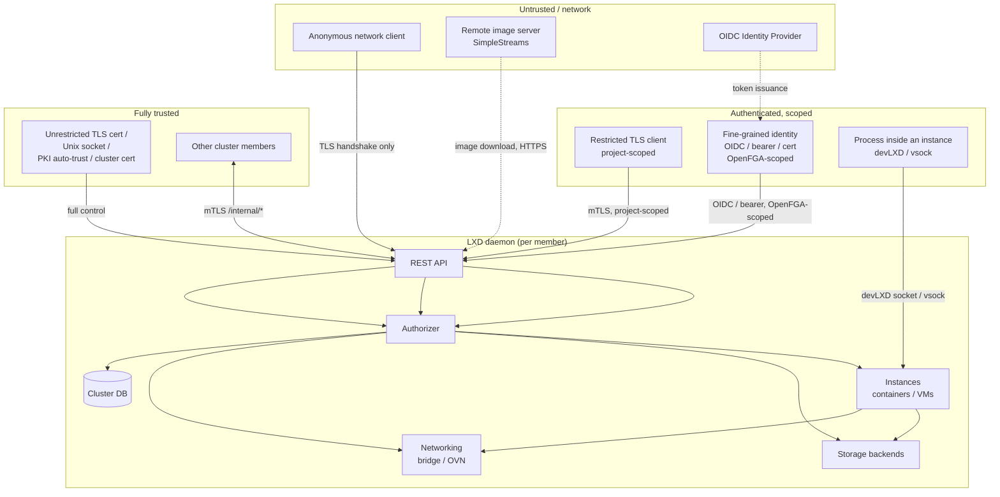

# LXD Threat Model

This document enumerates the threats LXD is designed to defend against, how those defenses
are implemented, and threats that are **not** (or only partially) addressed. It is a
companion to [ARCHITECTURE.md](ARCHITECTURE.md), which describes the components referenced
below, and to [SECURITY.md](SECURITY.md), which covers the vulnerability-reporting process and
what is/isn't considered a supported security boundary upstream.

This document is **inferred from the current codebase and documentation** (as of this
writing) rather than an official Canonical security assessment. It is intended to help new
contributors reason about the security posture of each component, not as an exhaustive audit.

## 1. Scope and methodology

The model is organized around the **trust boundaries** that exist in a deployed LXD system:
who can talk to what, with what credentials, and what they can do once "inside" each
boundary. For each boundary, threats are described along with the mitigation(s) currently
implemented and pointers into [ARCHITECTURE.md](ARCHITECTURE.md). [Section 4](#4-known-gaps-and-accepted-risks)
collects gaps and accepted risks without proposing fixes, per the request that motivated this
document.

## 2. Actors and trust boundaries

Key trust boundaries:

1. **Network ↔ LXD API** — anonymous and authenticated remote clients vs. the daemon.
2. **Restricted/fine-grained identity ↔ full admin** — the authorization layer
   ([ARCHITECTURE.md §5](ARCHITECTURE.md#5-authentication-identity-and-authorization)).
3. **Cluster member ↔ cluster member** — internal dqlite/Raft and heartbeat traffic
   ([ARCHITECTURE.md §4.3](ARCHITECTURE.md#43-clustergateway-mediating-dqlite-access)).
4. **Instance ↔ host** — container/VM isolation
   ([ARCHITECTURE.md §6.7](ARCHITECTURE.md#67-security-and-isolation-primitives)).
5. **Instance ↔ instance** — shared bridge networks, shared idmap ranges, shared storage
   backends.
6. **devLXD/vsock ↔ host** — the channel through which a (potentially compromised) instance
   talks back to the host.
7. **LXD ↔ external systems** — image servers, OIDC providers, remote storage (Ceph,
   PowerFlex, etc.), BGP peers.

---

## 3. Threats and mitigations

### 3.1 Remote API access (network ↔ LXD)

| Threat | Mitigation | Reference |
|---|---|---|
| Anonymous client invokes privileged API endpoints | Middleware rejects untrusted callers unless `AllowUntrusted` is set on the endpoint; `Daemon.Authenticate` must establish trust first | §3.4, §5.2 |
| Man-in-the-middle on the remote API | TLS 1.3+ required, ECDHE-only cipher suites; client pins the server certificate fingerprint on first connect (TOFU) | §5.7, [doc/authentication.md](doc/authentication.md) |
| Stolen/forged TLS client certificate used to impersonate a trusted client | `util.CheckMutualTLS` does constant-time fingerprint comparison against the identity cache; admins can revoke trust by removing the identity (`lxc config trust remove`), which is propagated via `identity.Cache.ReplaceAll` | §5.1, §5.2 |
| CA-signed certificate used to gain unintended access in PKI mode | `util.CheckCASignature` validates the full chain and checks `ca.crl` for revocation before honoring `core.trust_ca_certificates` auto-trust | §5.2 |
| Resource enumeration by a low-privilege caller (probing which instances/projects exist) | `CheckPermission` returns `404` (not `403`) when the caller lacks `can_view`, via `auth.IsDeniedError`, for both the `tls` and `embedded-openfga` drivers | §5.4 |
| Forwarded-request header spoofing between cluster members | `X-LXD-forwarded-*` headers are only honored on `/internal/*` endpoints, which are themselves gated to trusted cluster-member certificates | §3.4, §5.3 |
| Bearer token replay/reuse after revocation | Tokens are short-lived JWTs (default 24h) HMAC-signed per-identity; reuse of a revoked/expired token triggers an `authn_token_reuse` security event | §5.2, §5.6 |
| Failed login attempts going unnoticed | Every authentication failure path emits an `authn_login_fail` security event, observable via `/1.0/events`, `lxc monitor`, or Loki forwarding | §5.2, §3.5 |
| CORS / cross-origin browser attacks against the LXD UI | `http.NewCrossOriginProtection()` is applied in the request-handling pipeline; `shared/ws` `Upgrader.checkOrigin` enforces same-origin for websocket upgrades from browsers | §3.4, §9.2 |

### 3.2 Authorization (identity ↔ resources)

| Threat | Mitigation | Reference |
|---|---|---|
| Restricted TLS client accesses a project it isn't allowed to | `tls` driver checks `CallerAllowedProjectNames()` for every project-scoped entity | §5.4 |
| Restricted TLS client modifies global server/storage/network configuration | `tls` driver only grants project-scoped entitlements to restricted certs; server-level config requires `IsAdmin()` | §5.4 |
| Fine-grained identity (OIDC/bearer/cert) performs an action outside its granted entitlements | `embedded-openfga` driver evaluates the OpenFGA model (`openfga_model.openfga`) against the identity's direct and IdP-mapped group memberships | §5.4 |
| Identity-provider-group claim spoofing | `oidc.groups.claim` is read from the *verified* ID/access token issued by the configured IdP; LXD does not trust unsigned claims | §5.6 |
| Privilege escalation via the `permission_manager`/`admin` OpenFGA relations | These relations are intentionally powerful and documented as admin-equivalent; granting them is itself gated by `can_create_groups`/`can_edit_groups`-class entitlements | §5.4 — see also [§4](#4-known-gaps-and-accepted-risks) for residual risk |
| Operations performed before the cluster database is available (early daemon startup) | Falls back to the `tls` authorizer only (no OpenFGA), which still enforces project restriction and admin checks | §5.4 |

### 3.3 Clustering (member ↔ member)

| Threat | Mitigation | Reference |
|---|---|---|
| Unauthorized node joins the dqlite/Raft cluster | `Accept`/`Join` require a valid trust token issued by an existing admin-equivalent identity; new members' server certificates are added to every other member's identity cache as `CertificateServer` | §4.3, §5.7 |
| Non-member intercepts or injects internal database/Raft traffic | `/internal/database` and `/internal/raft` require mutual TLS via `tlsCheckCert`, checked against the cluster certificate and the `CertificateServer` identities | §4.3 |
| Stale member considered "alive" after it has failed | Heartbeats update `nodes.heartbeat`; `IsOffline()` flips after `cluster.offline_threshold` (default 20s), affecting placement and notifier targeting | §4.3 |
| Schema mismatch during rolling upgrade causes data corruption | `EnsureSchema()` returns `412 Precondition Failed` ("Upgrading") until all members are on a compatible schema version; `checkClusterIsUpgradable` enforces this | §4.2 |
| A request silently runs on the wrong member after a leadership change | `db.Cluster.Transaction` retries on `context.DeadlineExceeded`; `LeaderAddress()`/notifier logic redirect to the current leader | §4.3 |

### 3.4 Container isolation (instance ↔ host, containers)

| Threat | Mitigation | Reference |
|---|---|---|
| Container process reads/writes host files outside its rootfs via UID 0 | Unprivileged containers run in a user namespace; container UID 0 maps to an unprivileged host UID via `lxd/idmap`, so on-disk permissions are enforced by the host kernel as for any unprivileged user | §6.7, [doc/explanation/security.md](doc/explanation/security.md) |
| Container exploits a kernel syscall to escalate privileges | Static seccomp profile blocks known-dangerous syscalls (e.g. forced `umount`, `fsopen`); AppArmor profile additionally confines the container's `lxc-start`/init process | §6.3, §6.7 |
| Container needs a privileged operation (e.g. `mknod`, `mount` of a pseudo-fs) that would otherwise require a capability it doesn't have on the host | Seccomp-notify interception server performs the operation on the container's behalf **after verifying the calling process has the relevant capability inside its own user namespace** (`isCapableInCtInitUserns`), preventing confused-deputy escalation | §6.7 |
| Resource-exhaustion DoS by one container against the host or siblings | cgroup v1/v2 limits (memory, CPU, blkio, pids, hugetlb) applied per instance via `lxd/cgroup` | §6.3, §6.7 |
| Two unprivileged containers sharing the same idmap range interfere with each other's host-side resources (e.g. quota, per-UID limits) | Optional `security.idmap.isolated` gives each container a non-overlapping UID/GID range | §6.7, [doc/explanation/security.md](doc/explanation/security.md) — **opt-in, see §4** |
| Lingering helper process (e.g. `forkfile`) keeps a storage mount busy after instance stop, preventing pool unmount/cleanup | `Container.StopForkfile` explicitly terminates the per-instance `forkfile` daemon on stop (recent fix in this repository's history, canonical#18362) | §6.1, §6.9 |

### 3.5 VM isolation (instance ↔ host, virtual machines)

| Threat | Mitigation | Reference |
|---|---|---|
| Guest kernel/userspace compromise attempts to escape via QEMU device emulation | Hardware virtualization (KVM) provides the primary isolation boundary; QEMU process is confined by an AppArmor profile | §6.4, §6.7 |
| Guest exfiltrates host memory contents via speculative-execution or memory-disclosure bugs | Optional AMD SEV support (`setupSEV`) encrypts guest memory | §6.4 |
| Malicious guest attempts to abuse the virtio/9p/virtiofs shared-filesystem channel to access host files outside the configured share | Shares are explicitly configured per-device (disk devices, virtiofs mounts); the guest only sees what is exported | §6.4, §6.6 |
| Guest agent impersonation (a process other than the real `lxd-agent` connects to the host) | Mutual TLS over vsock using a per-VM agent certificate (`AgentCertificate`/`generateAgentCert`) distinct from the host's public certificates | §6.4, §10.2 |

### 3.6 Networking (instance ↔ instance, instance ↔ network)

| Threat | Mitigation | Reference |
|---|---|---|
| Instance spoofs another instance's MAC address on a shared bridge | `security.mac_filtering` (opt-in) enforces the assigned MAC via firewall rules | §8.5 |
| Instance spoofs another instance's IPv4/IPv6 address (ARP/NDP spoofing, source-address spoofing) | `security.ipv4_filtering`/`ipv6_filtering` (opt-in) block ARP/NDP advertisements and packets with spoofed source addresses; also drop non-ARP/IPv4/IPv6 frames (defeats 802.1ad Q-in-Q bypass) | §8.5 |
| Instance sends malicious IPv6 Router Advertisements to influence host or sibling routing | `security.ipv6_filtering` blocks RAs from the instance; routed NICs additionally disable `accept_ra` on the host-side veth and set `rp_filter=1` | §8.5, [doc/explanation/security.md](doc/explanation/security.md) — **bridge default differs, see §4** |
| Unauthorized traffic between projects/networks on an OVN deployment | Per-network OVN ACL port groups (`lxd_acl`/`lxd_net`) enforce ingress/egress rules at the logical-switch level, independent of the host firewall | §8.3 |
| ACL bypass via direct nftables/iptables manipulation by a co-located process | All LXD firewall rules live in a dedicated `lxd` table (nftables) or `lxd_nic`/`lxd_acl` chains (xtables), reducing accidental interference, but this is not a sandboxing mechanism against root on the host | §8.5 |
| DNS zone transfer (AXFR/IXFR) exfiltrates zone data | `lxd/dns` handler enforces TSIG or IP-allowlist (`isAllowed`) before serving transfers; unauthorized/unknown-zone queries return NXDOMAIN | §8.4 |

### 3.7 Storage

| Threat | Mitigation | Reference |
|---|---|---|
| Cross-project/instance access to another tenant's volume | Volume naming/lookup is mediated by `storage.Pool`/`lxdBackend`, which is only reachable through the authorized REST handlers (project-scoped entity URLs) | §7.1, §5.4 |
| Migration/copy of a volume between pools exposes data in transit | Migration traffic is tunneled over the existing authenticated operation websocket (TLS) | §6.8, §7.2 |
| Remote storage backend credentials (Ceph, PowerFlex, PowerStore, Pure, Alletra) leak via the API | Storage pool configuration containing credentials is only readable by identities with sufficient entitlement (`storage_pool_manager`/`admin`) | §5.4, §7 — see also §4 |
| Bucket (S3-compatible) access-key misuse | `CreateBucketKey`/`UpdateBucketKey`/`DeleteBucketKey` are per-bucket operations gated by the same authorization layer as other storage operations | §7.2 |

### 3.8 Image supply chain

| Threat | Mitigation | Reference |
|---|---|---|
| Image downloaded from a remote SimpleStreams server is tampered with in transit | Transport is HTTPS; `shared/simplestreams` verifies downloaded file hashes (SHA256) against the values listed in `metadata.json` | §9.2 |
| Compromised/malicious public image server serves a backdoored image | Hash verification only guarantees the downloaded bytes match the server's own metadata — see §4 for the trust implication |  §9.2 — see §4 |
| Locally cached image reused after the upstream image was revoked | `pruneExpiredBackupsTask`-style periodic tasks and explicit `lxc image delete`/alias management; caching has a configurable expiry | §6.8, §3.5 |

### 3.9 devLXD and the guest agent channel

| Threat | Mitigation | Reference |
|---|---|---|
| Process inside a container queries information about other instances/projects via the devLXD socket | `events.DevLXDServer` and `allowDevLXDPermission` scope devLXD operations to the calling instance's own context (`request.CtxDevLXDInstance`) | §3.5, §5.5 |
| Compromised guest uses its devLXD/vsock channel to pivot to the broader LXD API | The devLXD/vsock surface is a separate, deliberately reduced API (`ProtocolDevLXD`/`lxd-agent`), distinct from the admin-facing `/1.0/` API and the cluster-internal `/internal/*` API | §9.1, §10.2 |
| Guest reads its own bearer token / agent certificate and reuses it outside the VM | `TokenBearerDevLXD` tokens and per-VM `agent.crt`/`agent.key` are scoped to that instance's devLXD/agent audience and (for the agent cert) to the vsock transport | §5.1, §10.2 |

### 3.10 Local host access

| Threat | Mitigation | Reference |
|---|---|---|
| Unprivileged local user accesses the LXD Unix socket | Socket permissions restrict access to `root` and the `lxd` group; `SO_PEERCRED` is used to identify the caller, who is then granted full admin (`IsAdmin() == true`) | §5.2, [doc/explanation/security.md](doc/explanation/security.md) |
| Unprivileged user wants *some* container access without full `lxd` group membership | `lxd-user` provides a per-user proxy with an automatically-provisioned restricted project, certificate, network, and UID/GID-mapped device limits | §10.3 |
| Re-exec `forkXXX` helper invoked with attacker-influenced arguments performs an unintended host-side action | Each `forkXXX` helper is narrowly scoped to one operation and runs single-threaded for safe `setns()`/namespace entry; seccomp-notify-driven helpers additionally re-check capabilities in the container's own userns | §3.1, §6.7 — see also §4 |

---

## 4. Known gaps and accepted risks

The items below are potential gaps, accepted tradeoffs, or areas that would benefit from
further review. They are documented here as a starting point for risk discussions — **this
section deliberately does not propose fixes**.

1. **`core.trust_ca_certificates` is admin-equivalent for *any* CA-signed certificate.**
   When enabled, *every* certificate signed by the configured CA is auto-trusted as
   `ProtocolPKI`, which is treated as admin (`IsAdmin() == true`). If the configured CA is
   also used for other purposes (e.g. a corporate CA issuing certs for many services), a
   certificate never intended for LXD access would still grant full LXD admin. Mitigated only
   by `ca.crl` revocation and the operator's choice of CA scope.

2. **`permission_manager` / `admin` OpenFGA relations are self-privilege-escalation capable.**
   An identity holding either relation can grant itself (or any other identity) further
   permissions, including `admin`. There is no separation between "can manage permissions"
   and "can escalate to admin via permission management" — compromise of such an identity is
   equivalent to compromise of a full admin credential.

3. **Bearer tokens are unbound bearer credentials.** Possession of a valid, unexpired JWT is
   sufficient — there is no proof-of-possession or client binding. A token leaked via logs,
   shell history, browser storage, or a compromised intermediate proxy is usable by anyone
   until it expires or is explicitly revoked. The 24h default expiry bounds, but does not
   eliminate, this exposure.

4. **Bridged-NIC anti-spoofing features are opt-in and default to `false`.**
   `security.mac_filtering`, `security.ipv4_filtering`, and `security.ipv6_filtering` are all
   disabled by default. Out of the box, any instance on a shared `lxdbr0`-style bridge can
   send arbitrary layer-2 frames, including spoofed MAC/IP addresses and ARP/NDP
   advertisements affecting sibling instances.

5. **Default bridge accepts router advertisements from instances.** `lxdbr0`-style bridges
   are created with `accept_ra=2`, meaning the host accepts IPv6 router advertisements from
   connected instances even though `security.ipv6_filtering` (which would block them) is not
   enabled by default. A malicious instance can therefore influence the host's IPv6 routing
   table unless the operator has enabled filtering.

6. **`security.idmap.isolated` defaults to `false`.** Unprivileged containers share a common
   UID/GID range by default. Resources owned by that shared host UID range (e.g. per-UID
   `ulimit`s, quota, IPC namespaces keyed by UID) are a potential cross-container interference
   /DoS vector unless isolation is explicitly enabled per the documented `{tip}` in
   [doc/explanation/security.md](doc/explanation/security.md).

7. **Privileged containers remain explicitly non-root-safe.** Per [SECURITY.md](SECURITY.md)
   and [doc/explanation/security.md](doc/explanation/security.md), AppArmor/seccomp/capability
   drops for privileged containers (`security.privileged=true`) are described as reducing
   *accidental* damage, not as a security boundary. A root user inside a privileged container
   should be assumed able to compromise the host. This is a long-standing, explicitly
   documented design tradeoff rather than an oversight, but it remains a real exposure
   wherever privileged containers are enabled.

8. **Shared-kernel risk for unprivileged containers.** User namespaces turn most container
   escapes into "a bug that would also affect a normal unprivileged host user," but a kernel
   vulnerability reachable from an unprivileged user namespace (a recurring class of Linux
   CVEs) still affects all containers on the host. Seccomp profiles cover *known* dangerous
   syscalls but cannot protect against unknown vulnerabilities in syscalls that remain
   permitted.

9. **Cluster members form a single trust domain.** Any cluster member that is compromised can
   authenticate to every other member's `/internal/*` API as `ProtocolCluster`
   (admin-equivalent), and participates fully in dqlite/Raft. There is no per-member
   least-privilege boundary within the cluster — this is an architectural property of the
   clustering design, not a bug, but it means the blast radius of a single compromised member
   is "the entire cluster."

10. **Image authenticity relies on hash-matching against HTTPS-fetched metadata, not
    independent signatures.** `shared/simplestreams` verifies that downloaded image files
    match the SHA256 hashes listed in `metadata.json`, but if the same compromised/malicious
    server (or a MITM with a trusted-but-compromised CA) controls both the metadata and the
    image files, hash verification alone does not establish provenance. There is no
    GPG-style signature chain visible in the reviewed code path that is independent of the
    transport's TLS trust.

11. **Audit trail is not tamper-evident and not guaranteed complete.** Security events
    (`authn_login_fail`, `authn_token_reuse`, `sys_shutdown`, identity/group changes, etc.)
    are emitted over `/1.0/events` and can be forwarded to Loki, but: (a) an identity with
    admin access can disable or reconfigure event forwarding, removing the audit trail going
    forward; (b) there is no cryptographic chaining/sealing of the event log; (c) coverage of
    *which* actions emit security events versus only lifecycle events has not been
    exhaustively verified against this model.

12. **Identity-cache propagation delay after revocation.** `identity.Cache.ReplaceAll`
    performs an atomic in-memory swap, but in a cluster the underlying database change must
    propagate (via dqlite replication and each member's own cache-refresh cycle) before a
    revoked identity is rejected by *every* member. The exact worst-case window between
    "admin revokes an identity" and "all cluster members reject that identity" was not
    measured as part of this review.

13. **`forkXXX` re-exec helpers and seccomp-intercepted operations are a large, security
    -critical surface.** Helpers such as `forkfile` (SFTP into a container's mount
    namespace), `forkproxy`, `forknet`, and the seccomp-notify handlers for `mount`/`mknod`/
    `bpf`/etc. parse paths and parameters that are influenced (directly or indirectly) by
    instance configuration or in-container behavior. Each is individually scoped and
    capability-checked, but the aggregate surface is large and has historically been a source
    of CVEs in container runtimes generally (path traversal, symlink races, TOCTOU). This
    model does not re-audit each helper individually.

14. **Pre-cluster-DB-init window uses a less granular authorizer.** Before the cluster
    database is available, only the `tls` authorizer (project-restriction model) is active —
    fine-grained OpenFGA entitlements are not evaluated. This is a narrow startup window, but
    any request handled during it is subject to coarser rules than once OpenFGA is loaded.

15. **devLXD API surface includes storage CRUD operations.** `client.DevLXDServer` (used by
    `lxd-agent` and in-container processes) exposes instance and storage pool/volume/snapshot
    operations. The scoping of these to "only the calling instance's own resources" depends on
    `allowDevLXDPermission` and `request.CtxDevLXDInstance` being applied consistently across
    every devLXD handler — this consistency was not exhaustively verified endpoint-by-endpoint.

16. **OVN and firewall ACL enforcement depend on host networking stack configuration.**
    nftables/xtables rule placement assumes no other host firewall management tooling
    conflicts with the `lxd` table/`lxd_nic`/`lxd_acl` chains. A host running other firewall
    management (e.g. firewalld, a separate Kubernetes CNI) alongside LXD could create rule-
    ordering interactions that weaken ACL enforcement; this interaction is environment-
    dependent and not something LXD can fully control.

---

## 5. References

- [ARCHITECTURE.md](ARCHITECTURE.md) — component architecture referenced throughout this
  document.
- [SECURITY.md](SECURITY.md) — vulnerability reporting policy, supported versions, and what
  Canonical considers a security issue (notably: privileged-container escapes are *not*
  considered security issues; unprivileged-container escapes *are*).
- [doc/explanation/security.md](doc/explanation/security.md) — user-facing security
  explanation (daemon access, container security, network security, audit logging).
- [doc/authentication.md](doc/authentication.md) — remote API authentication mechanisms.
- [doc/explanation/authorization.md](doc/explanation/authorization.md) — restricted TLS
  certificates and fine-grained authorization.
- [doc/internals.md](doc/internals.md) — syscall interception and user-namespace/idmap
  internals referenced in §3.4.
